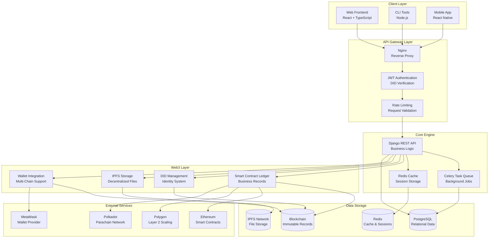
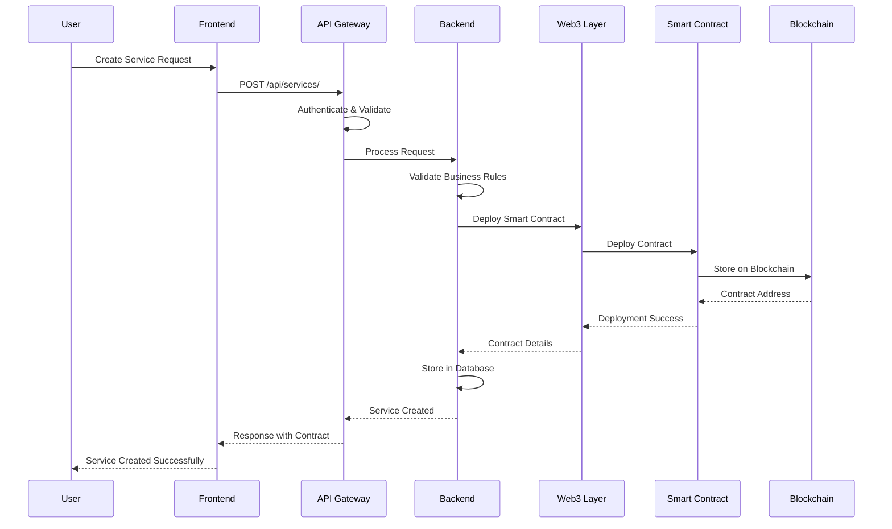
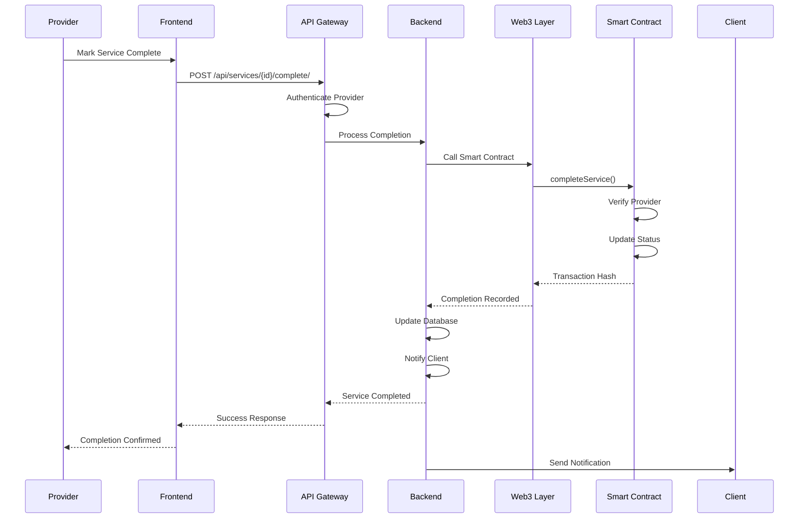
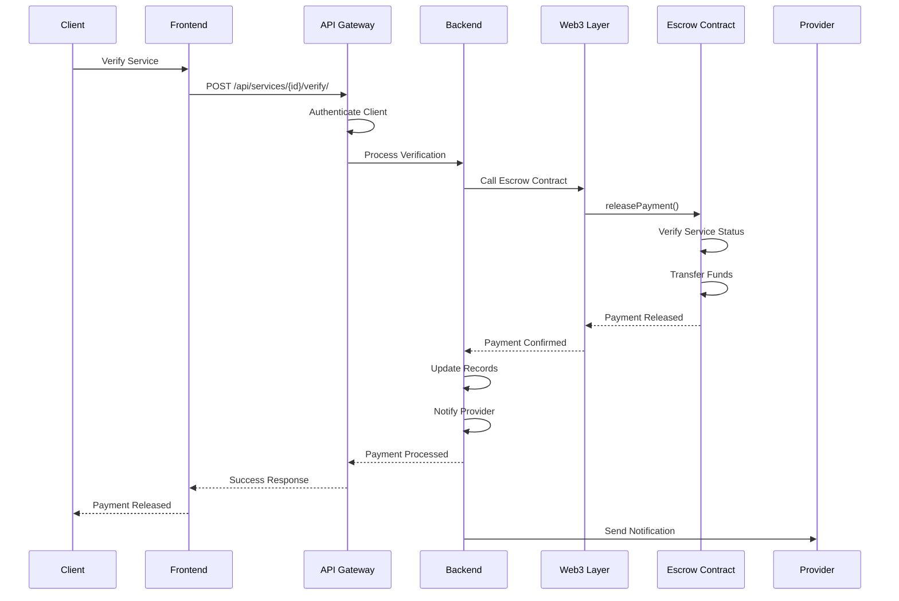
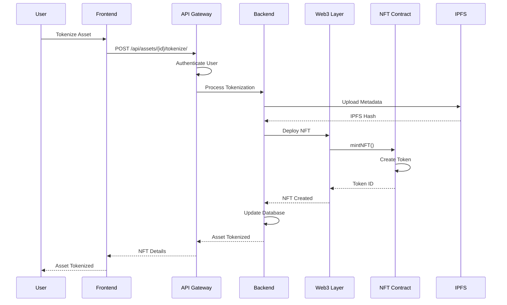

# TidyGen ERP - System Architecture

## 🏗️ High-Level System Overview

TidyGen ERP is a comprehensive **Web3-enabled Enterprise Resource Planning platform** designed for the cleaning services industry. The system combines traditional ERP functionality with cutting-edge blockchain technology, providing a decentralized, transparent, and trustless business management solution.

### **Core Architecture Principles**

- **Modular Design**: Loosely coupled components for scalability and maintainability
- **Web3-First**: Blockchain integration at the core of business operations
- **API-First**: RESTful APIs for all system interactions
- **Multi-Chain Support**: Cross-blockchain compatibility and interoperability
- **Decentralized Storage**: IPFS for metadata and document storage
- **Smart Contract Automation**: Automated business logic execution

---

## 🎯 System Architecture Diagram

---

## 🔧 Component Descriptions

### **Client Layer**

#### **Web Frontend (React + TypeScript)**
- **Purpose**: Primary user interface for business operations
- **Technology**: React 18, TypeScript, Tailwind CSS, Web3.js
- **Features**:
  - Dashboard with real-time analytics
  - Service management interface
  - Asset tokenization UI
  - Web3 wallet integration
  - Mobile-responsive design

#### **CLI Tools (Node.js)**
- **Purpose**: Command-line interface for developers and power users
- **Technology**: Node.js, Commander.js, Web3.js
- **Features**:
  - Service deployment automation
  - Smart contract interaction
  - Batch operations
  - System administration

#### **Mobile App (React Native)**
- **Purpose**: Field operations and mobile workforce management
- **Technology**: React Native, Expo, Web3 integration
- **Features**:
  - Service completion tracking
  - GPS location services
  - Photo documentation
  - Offline capability

### **API Gateway Layer**

#### **Nginx (Reverse Proxy)**
- **Purpose**: Load balancing, SSL termination, and request routing
- **Configuration**:
  - SSL/TLS encryption
  - Gzip compression
  - Static file serving
  - Health check endpoints

#### **JWT Authentication & DID Verification**
- **Purpose**: Multi-layered authentication system
- **Features**:
  - Traditional JWT tokens
  - Decentralized Identity (DID) verification
  - Multi-factor authentication
  - Session management

#### **Rate Limiting & Request Validation**
- **Purpose**: API protection and abuse prevention
- **Features**:
  - Per-IP rate limiting
  - Request size validation
  - Input sanitization
  - DDoS protection

### **Core Engine**

#### **Django REST API (Business Logic)**
- **Purpose**: Core business logic and API endpoints
- **Technology**: Django 4.2+, Django REST Framework, Python 3.12+
- **Modules**:
  - User Management & Authentication
  - Service Management & Scheduling
  - Inventory & Asset Management
  - Financial Management & Payments
  - Field Operations & Route Optimization
  - Analytics & Reporting

#### **Celery Task Queue (Background Jobs)**
- **Purpose**: Asynchronous task processing
- **Technology**: Celery, Redis, RabbitMQ
- **Tasks**:
  - Smart contract deployment
  - Payment processing
  - Email notifications
  - Data synchronization
  - Report generation

#### **Redis Cache (Session Storage)**
- **Purpose**: High-performance caching and session management
- **Technology**: Redis 7+
- **Features**:
  - API response caching
  - Session storage
  - Real-time data
  - Pub/Sub messaging

### **Web3 Layer**

#### **Smart Contract Ledger (Business Records)**
- **Purpose**: Immutable business record storage
- **Technology**: Solidity, Web3.py, ethers.js
- **Contracts**:
  - `TidyGenERP.sol`: Core business logic
  - `ServiceVerification.sol`: Service completion tracking
  - `PaymentEscrow.sol`: Trustless payment processing
  - `AssetTokenization.sol`: NFT-based asset management
  - `TidyGenDAO.sol`: Decentralized governance

#### **DID Management (Identity System)**
- **Purpose**: Decentralized identity and access control
- **Technology**: DID specification, cryptographic signatures
- **Features**:
  - Self-sovereign identity
  - Cross-platform compatibility
  - Privacy-preserving authentication
  - Verifiable credentials

#### **IPFS Storage (Decentralized Files)**
- **Purpose**: Decentralized file and metadata storage
- **Technology**: IPFS, Pinata, Filecoin
- **Features**:
  - Document storage
  - Image and media files
  - Metadata storage
  - Content addressing

#### **Wallet Integration (Multi-Chain Support)**
- **Purpose**: Multi-blockchain wallet connectivity
- **Technology**: Web3.js, ethers.js, Polkadot.js
- **Features**:
  - MetaMask integration
  - WalletConnect support
  - Multi-chain transactions
  - Cross-chain asset transfers

### **Data Storage**

#### **PostgreSQL (Relational Data)**
- **Purpose**: Primary database for business data
- **Technology**: PostgreSQL 15+
- **Features**:
  - ACID compliance
  - JSON support
  - Full-text search
  - Multi-tenant architecture

#### **Redis (Cache & Sessions)**
- **Purpose**: High-performance caching and session storage
- **Technology**: Redis 7+
- **Features**:
  - In-memory storage
  - Pub/Sub messaging
  - Data persistence
  - Clustering support

#### **IPFS Network (File Storage)**
- **Purpose**: Decentralized file storage
- **Technology**: IPFS, Pinata
- **Features**:
  - Content addressing
  - Distributed storage
  - Version control
  - Access control

#### **Blockchain (Immutable Records)**
- **Purpose**: Immutable business record storage
- **Networks**: Ethereum, Polygon, Polkadot
- **Features**:
  - Tamper-proof records
  - Public verification
  - Smart contract execution
  - Cross-chain compatibility

---

## 🔄 Interaction Flow Between Modules

### **Service Creation Flow**

### **Service Completion Flow**

### **Payment Processing Flow**

### **Asset Tokenization Flow**

---

## 🔗 Data Flow Architecture

### **On-Chain Data**
- **Service Records**: Immutable service completion records
- **Payment Transactions**: Cryptocurrency payment history
- **Asset Ownership**: NFT-based asset ownership records
- **Governance Decisions**: DAO voting and proposal records
- **Identity Verification**: DID-based identity records

### **Off-Chain Data**
- **User Profiles**: Personal and business information
- **Service Details**: Detailed service descriptions and requirements
- **Financial Records**: Traditional accounting and bookkeeping
- **Analytics Data**: Performance metrics and business intelligence
- **Document Storage**: Contracts, invoices, and legal documents

### **Hybrid Data Storage**
- **Metadata**: On-chain hashes pointing to off-chain data
- **File Storage**: IPFS for documents with blockchain verification
- **Caching**: Redis for frequently accessed data
- **Synchronization**: Real-time sync between on-chain and off-chain data

---

## 🚀 Scalability Considerations

### **Horizontal Scaling**
- **Load Balancing**: Nginx load balancer for API requests
- **Database Sharding**: Organization-based data partitioning
- **Microservices**: Modular architecture for independent scaling
- **CDN Integration**: Global content delivery for static assets

### **Performance Optimization**
- **Caching Strategy**: Multi-layer caching with Redis
- **Database Indexing**: Optimized queries and indexes
- **Connection Pooling**: Efficient database connections
- **Async Processing**: Celery for background tasks

### **Blockchain Optimization**
- **Gas Optimization**: Efficient smart contract design
- **Layer 2 Solutions**: Polygon for reduced transaction costs
- **Batch Operations**: Multiple operations in single transaction
- **Cross-Chain Efficiency**: Optimized bridge operations

---

## 🔒 Security Architecture

### **Authentication & Authorization**
- **Multi-Factor Authentication**: JWT + DID verification
- **Role-Based Access Control**: Granular permissions
- **Session Management**: Secure session handling
- **API Security**: Rate limiting and input validation

### **Data Protection**
- **Encryption at Rest**: Database and file encryption
- **Encryption in Transit**: TLS/SSL for all communications
- **Privacy Controls**: User data privacy and GDPR compliance
- **Audit Trails**: Comprehensive logging and monitoring

### **Smart Contract Security**
- **Formal Verification**: Mathematical proof of correctness
- **Security Audits**: Professional third-party audits
- **Access Controls**: Multi-signature and role-based controls
- **Emergency Procedures**: Pause and upgrade mechanisms

---

## 📊 Monitoring & Observability

### **Application Monitoring**
- **Health Checks**: System health and availability monitoring
- **Performance Metrics**: Response times and throughput
- **Error Tracking**: Exception monitoring and alerting
- **User Analytics**: Usage patterns and behavior analysis

### **Blockchain Monitoring**
- **Transaction Tracking**: Real-time transaction monitoring
- **Smart Contract Events**: Event logging and analysis
- **Gas Usage**: Transaction cost optimization
- **Network Status**: Blockchain network health monitoring

### **Infrastructure Monitoring**
- **Server Metrics**: CPU, memory, and disk usage
- **Database Performance**: Query performance and optimization
- **Network Monitoring**: Bandwidth and latency tracking
- **Security Monitoring**: Intrusion detection and prevention

---

This architecture provides a robust, scalable, and secure foundation for the TidyGen ERP platform, enabling seamless integration of traditional ERP functionality with cutting-edge Web3 technology.