# TidyGen Community Edition - System Architecture

## 📋 **Table of Contents**

1. [Overview](#overview)
2. [System Components](#system-components)
3. [Architecture Layers](#architecture-layers)
4. [Data Flow](#data-flow)
5. [Use Cases](#use-cases)
6. [Integration Points](#integration-points)
7. [Security Architecture](#security-architecture)
8. [Deployment Architecture](#deployment-architecture)

---

## 1. Overview

### **Hybrid Web2 + Web3 Design**

TidyGen Community Edition implements a **hybrid architecture** that combines traditional Web2 technologies (Django REST API, PostgreSQL database) with cutting-edge Web3 blockchain capabilities (Substrate pallets, Polkadot.js). This approach provides:

- ✅ **Best of Both Worlds**: Fast, familiar Web2 UX with Web3 transparency and immutability
- ✅ **Gradual Adoption**: Users can leverage blockchain features without abandoning existing workflows
- ✅ **Data Sovereignty**: Critical data anchored on-chain, operational data in traditional database
- ✅ **Scalability**: High-performance database for queries, blockchain for verification
- ✅ **Interoperability**: Seamless integration between centralized and decentralized layers

### **Design Philosophy**

```
┌─────────────────────────────────────────────────────────┐
│                                                         │
│  Traditional ERP Functionality (Web2)                   │
│  ├─ Fast queries and reporting                         │
│  ├─ Complex business logic                             │
│  ├─ User-friendly interfaces                           │
│  └─ Familiar authentication                            │
│                                                         │
│                         +                               │
│                                                         │
│  Blockchain Enhancements (Web3)                         │
│  ├─ Immutable audit trails                             │
│  ├─ Decentralized identity                             │
│  ├─ DAO governance                                     │
│  └─ Cryptographic verification                         │
│                                                         │
│                         =                               │
│                                                         │
│  Next-Generation ERP System                             │
│                                                         │
└─────────────────────────────────────────────────────────┘
```

---

## 2. System Components

### **Component Stack**

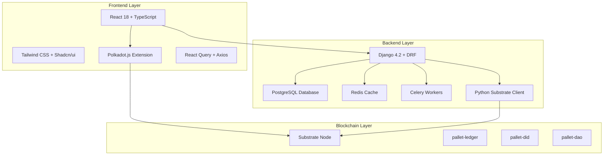

### **2.1 Frontend: React + TypeScript**

**Technology Stack:**
- React 18 with TypeScript
- Vite for build tooling
- Tailwind CSS for styling
- Shadcn/ui component library
- React Query for state management
- Polkadot.js for blockchain interaction

**Key Features:**
- Single Page Application (SPA)
- Server-side rendering ready
- Real-time updates via WebSocket
- Responsive design
- Progressive Web App (PWA) capable

**Web3 Integration:**
- Polkadot.js extension connection
- Wallet management UI
- Transaction signing
- Blockchain state queries

### **2.2 Backend: Django REST Framework**

**Technology Stack:**
- Django 4.2
- Django REST Framework (DRF)
- PostgreSQL for relational data
- Redis for caching and sessions
- Celery for async tasks
- JWT authentication

**Key Features:**
- RESTful API design
- Role-based access control (RBAC)
- Comprehensive business logic
- 25 ERP modules
- API documentation (Swagger/OpenAPI)

**Web3 Integration:**
- Python substrate-interface library
- Automatic blockchain anchoring
- DID-based authentication
- DAO proposal synchronization

### **2.3 Blockchain: Substrate Runtime**

**Technology Stack:**
- Substrate FRAME
- Rust 2021 edition
- WebAssembly runtime
- RocksDB for chain storage

**Custom Pallets:**
1. **pallet-ledger**: Invoice and transaction ledger
2. **pallet-did**: Decentralized identity management
3. **pallet-dao**: On-chain governance

**Consensus:**
- Development: Instant finality (dev mode)
- Production: Aura + GRANDPA (or parachain)

---

## 3. Architecture Layers

### **Three-Tier Architecture**

```
┌─────────────────────────────────────────────────────┐
│                                                     │
│  PRESENTATION LAYER (Frontend)                      │
│  ┌─────────────┐  ┌──────────────┐  ┌───────────┐ │
│  │   React UI  │  │ Polkadot.js  │  │  Wallet   │ │
│  │   Components│  │  Extension   │  │ Extension │ │
│  └──────┬──────┘  └───────┬──────┘  └─────┬─────┘ │
│         │                 │                │       │
└─────────┼─────────────────┼────────────────┼───────┘
          │                 │                │
          │                 │                │
┌─────────┼─────────────────┼────────────────┼───────┐
│         │                 │                │       │
│  APPLICATION LAYER (Backend)                │       │
│  ┌──────▼──────┐  ┌───────▼────────┐      │       │
│  │   Django    │  │   Substrate    │      │       │
│  │ REST API    │  │     Client     │      │       │
│  └──────┬──────┘  └───────┬────────┘      │       │
│         │                 │                │       │
│  ┌──────▼──────┐  ┌───────▼────────┐      │       │
│  │ PostgreSQL  │  │   WebSocket    │      │       │
│  │   Database  │  │   RPC Client   │      │       │
│  └─────────────┘  └───────┬────────┘      │       │
│                            │                │       │
└────────────────────────────┼────────────────┼───────┘
                             │                │
                             │                │
┌────────────────────────────┼────────────────┼───────┐
│                            │                │       │
│  BLOCKCHAIN LAYER (Substrate)               │       │
│                     ┌──────▼────────┐       │       │
│                     │   Substrate   │◄──────┘       │
│                     │     Node      │               │
│                     └──────┬────────┘               │
│                            │                        │
│         ┌──────────────────┼──────────────────┐     │
│         │                  │                  │     │
│  ┌──────▼──────┐  ┌────────▼────┐  ┌────────▼────┐│
│  │   Ledger    │  │     DID     │  │     DAO     ││
│  │   Pallet    │  │   Pallet    │  │   Pallet    ││
│  └─────────────┘  └─────────────┘  └─────────────┘│
│                                                     │
│  ┌─────────────────────────────────────────────┐   │
│  │         On-Chain Storage (RocksDB)          │   │
│  └─────────────────────────────────────────────┘   │
│                                                     │
└─────────────────────────────────────────────────────┘
```

---

## 4. Data Flow

### **4.1 Dual Data Flow Architecture**

TidyGen implements two distinct data flow patterns:

#### **Flow 1: React → Django → Substrate (Backend-Initiated)**

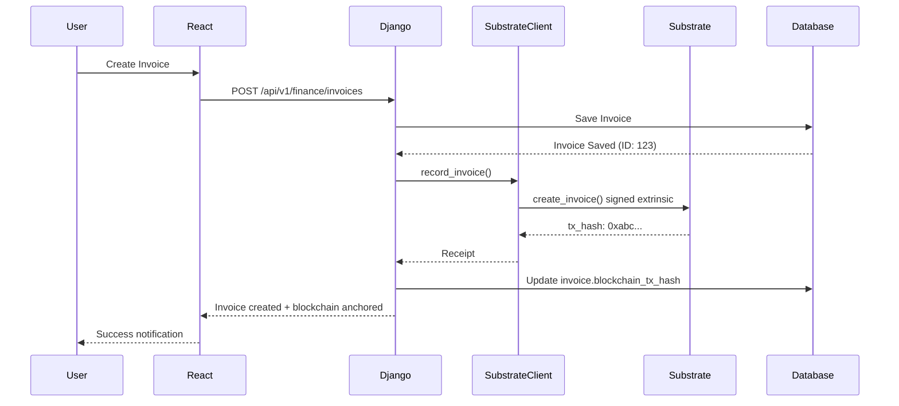

**Use Cases:**
- Automatic blockchain anchoring
  - Batch operations
- System-initiated transactions
- Background synchronization

#### **Flow 2: React → Polkadot.js → Substrate (User-Initiated)**

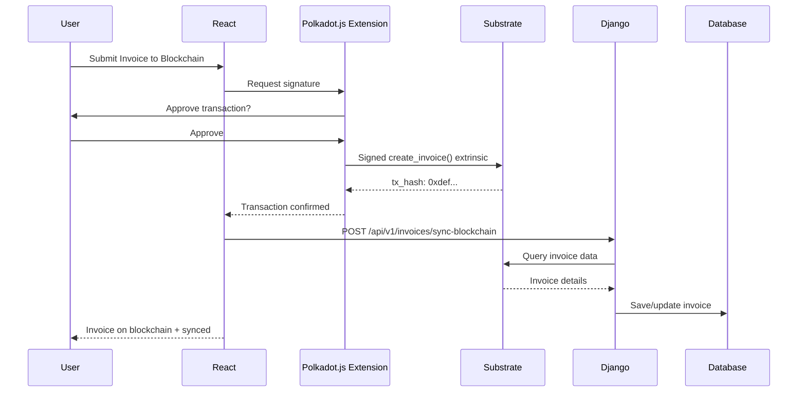

**Use Cases:**
- User-controlled transactions
- Governance voting
- DID registration
- Direct blockchain interaction

### **4.2 Data Synchronization Strategy**

```
┌─────────────────────────────────────────────────────┐
│                                                     │
│  Django Database (Source of Truth for Operations)   │
│  ┌─────────────────────────────────────────────┐   │
│  │  • User accounts and authentication         │   │
│  │  • Business logic and workflows             │   │
│  │  │  • Complex queries and reporting          │   │
│  │  • Soft deletions and history               │   │
│  └────────────┬────────────────────────────────┘   │
│               │                                     │
│               │ Selective Anchoring                 │
│               │                                     │
│               ▼                                     │
│  ┌─────────────────────────────────────────────┐   │
│  │  Blockchain Reference Fields                │   │
│  │  • blockchain_tx_hash                       │   │
│  │  • blockchain_anchored (boolean)            │   │
│  │  • blockchain_block_number                  │   │
│  └────────────┬────────────────────────────────┘   │
│               │                                     │
└───────────────┼─────────────────────────────────────┘
                │
                ▼
┌─────────────────────────────────────────────────────┐
│                                                     │
│  Substrate Blockchain (Source of Truth for Audit)   │
│  ┌─────────────────────────────────────────────┐   │
│  │  • Immutable audit trail                    │   │
│  │  • Cryptographic verification               │   │
│  │  • Decentralized identity                   │   │
│  │  • Governance decisions                     │   │
│  └─────────────────────────────────────────────┘   │
│                                                     │
└─────────────────────────────────────────────────────┘
```

---

## 5. Use Cases

### **Use Case 1: Invoice Creation and Blockchain Anchoring**

#### **Scenario**
A finance manager creates an invoice for a client, and the system automatically anchors it to the blockchain for tamper-proof verification.

#### **Complete Flow**

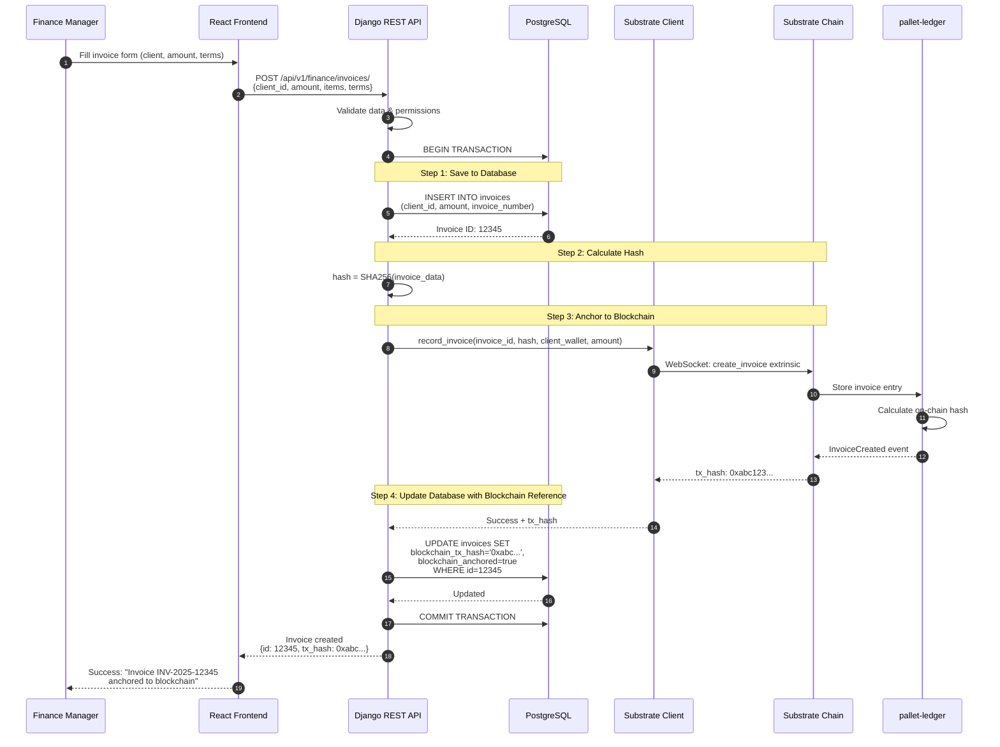

#### **Data Storage**

**In PostgreSQL:**
```sql
invoices (
    id: 12345,
    client_id: 456,
    amount: 1000.00,
    invoice_number: "INV-2025-12345",
    created_at: "2025-10-22 00:00:00",
    blockchain_tx_hash: "0xabc123...",
    blockchain_anchored: true,
    -- other business fields
)
```

**On Substrate Blockchain:**
```rust
Invoice {
    id: 0,
    client: 5GrwvaEF...,
    amount: 1000000000,  // Smallest unit
    metadata: "INV-2025-12345|Client XYZ|Net 30",
    timestamp: 42,  // Block number
    invoice_hash: [a1, b2, c3, ...],  // SHA256
    created_by: 5FHneW...
}
```

#### **Verification Process**

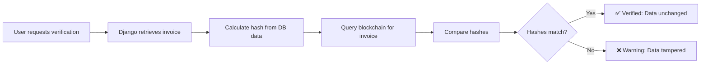

**Benefits:**
- ✅ **Immutability**: Invoice cannot be altered without detection
- ✅ **Transparency**: Anyone can verify the invoice on-chain
- ✅ **Audit Trail**: Complete history preserved on blockchain
- ✅ **Trust**: No need to trust the database

---

### **Use Case 2: User Authentication with Decentralized Identity**

#### **Scenario**
A user registers with the system and gets a decentralized identity (DID) for password-less authentication.

#### **Registration Flow**

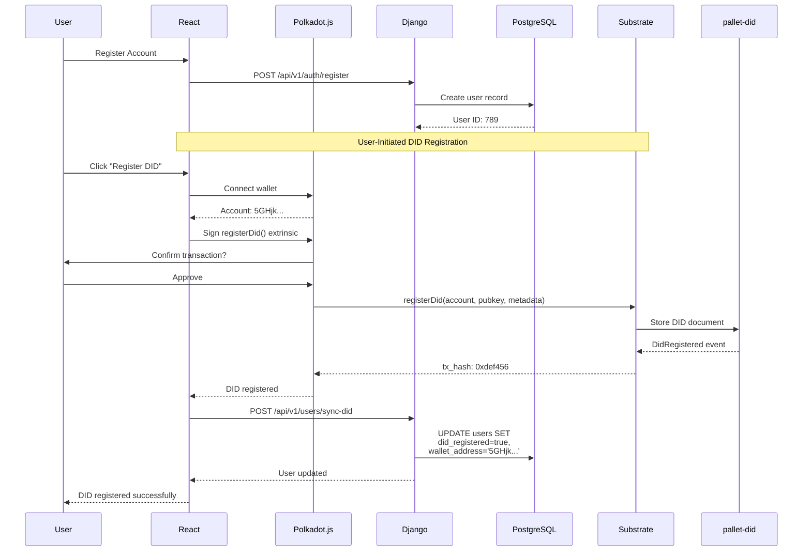

#### **Authentication Flow (Password-less)**

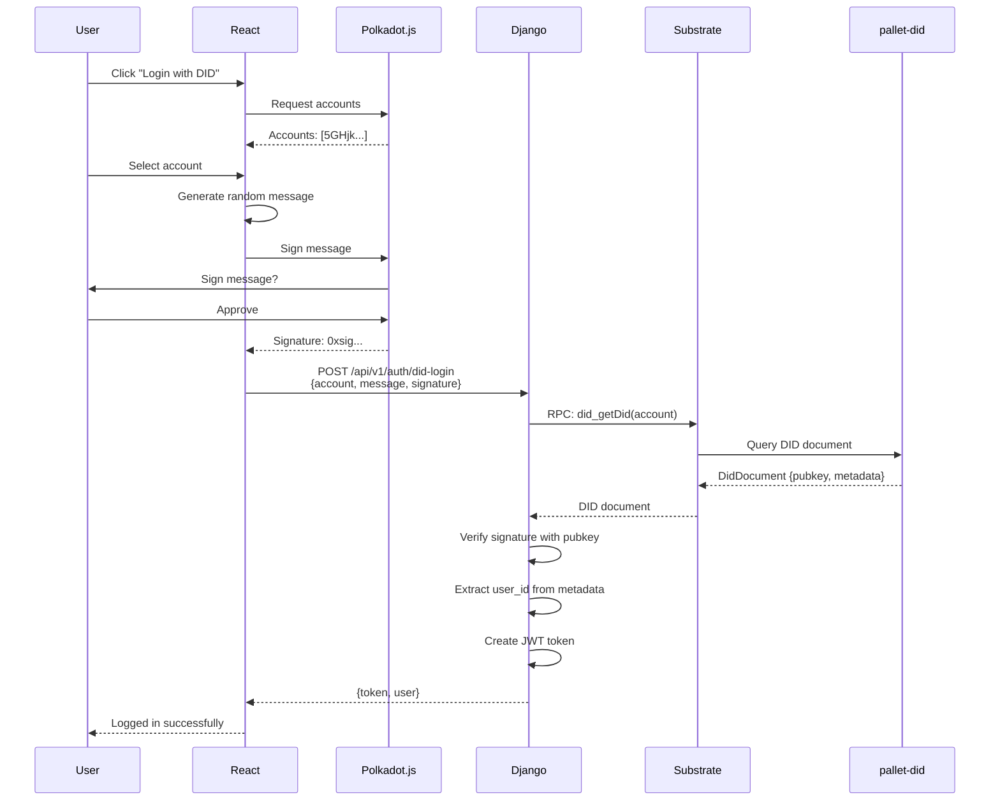

---

### **Use Case 3: DAO Governance for Budget Approval**

#### **Scenario**
The finance team creates a proposal to approve Q4 budget, and stakeholders vote on it democratically.

#### **Complete Governance Flow**

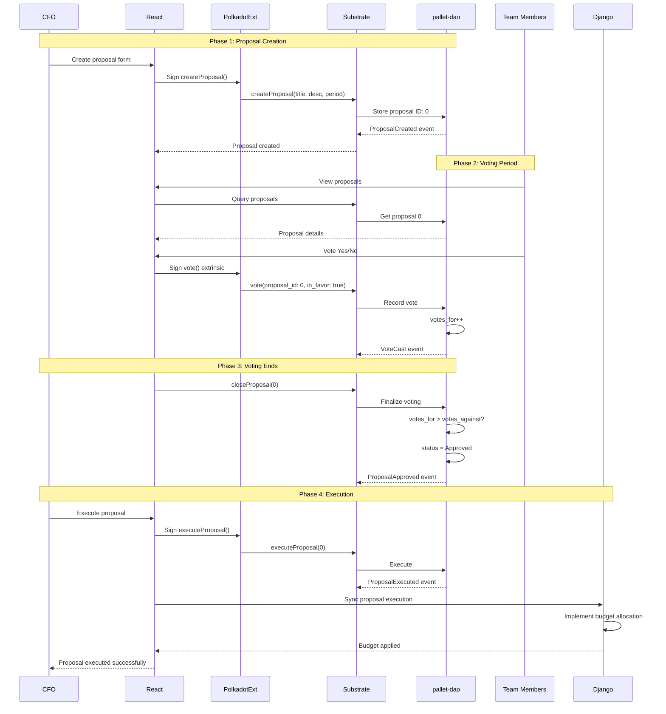

---

## 6. Integration Points

### **6.1 Frontend-Backend Integration**

```
React Components → Django REST API
───────────────────────────────────

Authentication:
  POST /api/v1/auth/login
  POST /api/v1/auth/did-login  ✨ DID-based

Invoice Management:
  GET  /api/v1/finance/invoices
  POST /api/v1/finance/invoices
  POST /api/v1/finance/invoices/{id}/anchor  ✨ Blockchain

DAO Governance:
  GET  /api/v1/web3/proposals
  POST /api/v1/web3/proposals
  POST /api/v1/web3/proposals/{id}/vote
  POST /api/v1/web3/proposals/{id}/sync  ✨ Blockchain sync
```

### **6.2 Backend-Blockchain Integration**

```python
# Django → Substrate (via Python client)

from services.substrate_client import SubstrateClient

# Create client
client = SubstrateClient(keypair_uri='//Alice')

# Submit transaction
tx_hash, receipt = client.record_invoice(
    user_id=user.id,
    invoice_hash=invoice.calculate_hash(),
    client_account=client.wallet_address,
    amount=int(invoice.amount * 1000000),
    metadata=f"{invoice.number}|{client.name}"
)

# Query data
invoices = client.get_invoices(account_id)
did_doc = client.get_did(account_id)
proposal = client.get_proposal(proposal_id)
```

### **6.3 Frontend-Blockchain Integration**

```typescript
// React → Substrate (via Polkadot.js)

import { submitInvoice, connectWallet } from '../web3';

// Connect wallet
const accounts = await connectWallet();

// Submit transaction
const result = await submitInvoice(
  {
    client: clientAddress,
    amount: 1000000,
    metadata: 'INV-2025-001'
  },
  accounts[0]
);

// Query blockchain
const invoices = await queryInvoices(accountId);
const didDoc = await queryDID(accountId);
const proposal = await queryProposal(proposalId);
```

---

## 7. Security Architecture

### **7.1 Multi-Layer Security**

```
┌─────────────────────────────────────────────────────┐
│  Layer 1: Network Security                          │
│  ├─ HTTPS/WSS in production                        │
│  ├─ CORS configuration                             │
│  ├─ Rate limiting                                  │
│  └─ DDoS protection                                │
└─────────────────────────────────────────────────────┘
                        │
                        ▼
┌─────────────────────────────────────────────────────┐
│  Layer 2: Application Security                      │
│  ├─ JWT authentication                             │
│  ├─ Role-based access control (RBAC)               │
│  ├─ Input validation                               │
│  └─ SQL injection prevention                       │
└─────────────────────────────────────────────────────┘
                        │
                        ▼
┌─────────────────────────────────────────────────────┐
│  Layer 3: Blockchain Security                       │
│  ├─ Cryptographic signatures                       │
│  ├─ On-chain access control                        │
│  ├─ Immutable audit logs                           │
│  └─ DID-based authentication                       │
└─────────────────────────────────────────────────────┘
```

### **7.2 Authentication Flow**

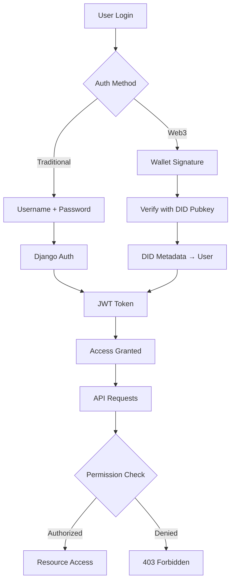

---

## 8. Deployment Architecture

### **8.1 Development Environment**

```
┌─────────────────────────────────────────────────────┐
│  Developer Machine                                   │
│                                                      │
│  ┌──────────────┐  ┌──────────────┐  ┌───────────┐ │
│  │   Frontend   │  │   Backend    │  │ Substrate │ │
│  │              │  │              │  │   Node    │ │
│  │ localhost    │  │ localhost    │  │ localhost │ │
│  │   :5173      │  │   :8002      │  │   :9944   │ │
│  └──────────────┘  └──────────────┘  └───────────┘ │
│                                                      │
│  ┌──────────────┐  ┌──────────────┐                 │
│  │  PostgreSQL  │  │    Redis     │                 │
│  │    :5432     │  │    :6379     │                 │
│  └──────────────┘  └──────────────┘                 │
│                                                      │
└─────────────────────────────────────────────────────┘
```

### **8.2 Production Architecture (Docker)**

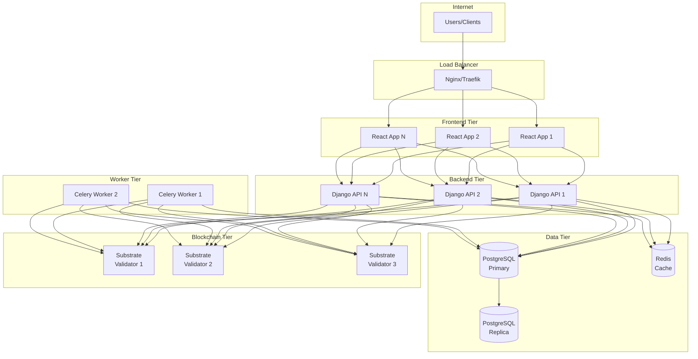

### **8.3 Technology Stack Summary**

| Layer | Technology | Purpose |
|-------|------------|---------|
| **Frontend** | React 18 + TypeScript | User interface |
| **Styling** | Tailwind CSS + Shadcn/ui | Modern UI components |
| **State** | React Query + Zustand | State management |
| **Web3** | Polkadot.js API | Blockchain interaction |
| **Backend** | Django 4.2 + DRF | Business logic & API |
| **Database** | PostgreSQL 15 | Relational data |
| **Cache** | Redis 7 | Session & caching |
| **Tasks** | Celery + RabbitMQ | Async processing |
| **Blockchain** | Substrate (Rust) | On-chain logic |
| **Pallets** | FRAME pallets | Custom business logic |
| **Storage** | RocksDB | Blockchain state |
| **Network** | WebSocket + HTTP | Communication |

---

## 9. System Architecture Diagram

### **Complete System Overview**

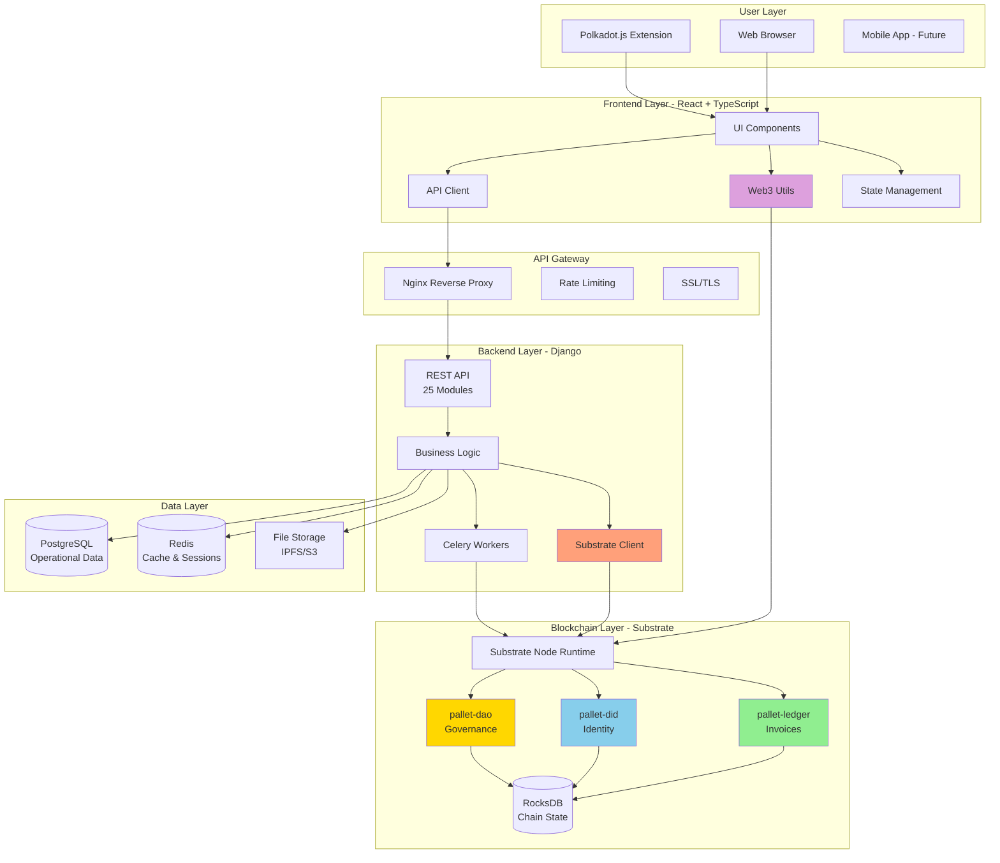

---

## 10. Data Flow Patterns

### **Pattern 1: Write to Database, Anchor to Blockchain**

```
User Action
    │
    ▼
Django Creates Record
    │
    ├─► PostgreSQL: Full data
    │
    └─► Substrate: Hash + key fields
            │
            └─► Immutable audit trail
```

**Example:** Invoices, Contracts, Payroll

### **Pattern 2: Write to Blockchain, Sync to Database**

```
User Action (Web3)
    │
    ▼
Polkadot.js Transaction
    │
    ▼
Substrate Pallet
    │
    ├─► On-chain storage
    │
    └─► Event emission
            │
            ▼
        Django Listens
            │
            ▼
        Database Sync
```

**Example:** DAO Voting, DID Registration

### **Pattern 3: Query Both Layers**

```
User Request
    │
    ├─► Django: Business data
    │       │
    │       └─► Quick response
    │
    └─► Substrate: Verification
            │
            └─► Proof of authenticity
```

**Example:** Invoice Verification, DID Lookup

---

## 11. Performance Optimization

### **11.1 Caching Strategy**

```
┌─────────────────────────────────────────┐
│  Level 1: Browser Cache                 │
│  • Static assets (24 hours)             │
│  • API responses (React Query, 5 min)   │
└─────────────────────────────────────────┘
                  │
                  ▼
┌─────────────────────────────────────────┐
│  Level 2: Redis Cache                   │
│  • Session data                         │
│  • Frequently accessed data             │
│  • Blockchain query results (1 min)     │
└─────────────────────────────────────────┘
                  │
                  ▼
┌─────────────────────────────────────────┐
│  Level 3: Database Query Cache          │
│  • PostgreSQL query result cache        │
└─────────────────────────────────────────┘
                  │
                  ▼
┌─────────────────────────────────────────┐
│  Level 4: Blockchain State              │
│  • On-chain immutable data              │
│  • No cache (always query for proof)    │
└─────────────────────────────────────────┘
```

### **11.2 Scalability Approach**

| Component | Scaling Strategy |
|-----------|------------------|
| Frontend | CDN + Static hosting (Vercel/Netlify) |
| Django API | Horizontal scaling (multiple instances) |
| PostgreSQL | Read replicas + connection pooling |
| Redis | Redis Cluster for high availability |
| Substrate | Validator set or parachain deployment |
| Celery | Auto-scaling worker pool |

---

## 12. Future Enhancements

### **Phase 2: Parachain Deployment**

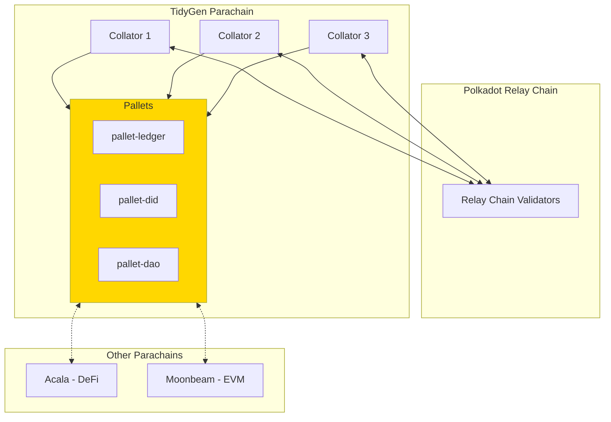

### **Roadmap**

- **Q1 2026**: Parachain deployment on testnet
- **Q2 2026**: XCM integration with other parachains
- **Q3 2026**: Mainnet parachain launch
- **Q4 2026**: Cross-chain asset management

---

## 13. Key Architectural Decisions

### **Why Hybrid (Web2 + Web3)?**

| Aspect | Web2 (Django) | Web3 (Substrate) |
|--------|---------------|------------------|
| **Speed** | Very fast | Slower (block time) |
| **Cost** | Low | Gas fees |
| **Queryability** | Excellent | Limited |
| **Immutability** | No | Yes |
| **Trust** | Trust provider | Trustless |
| **Privacy** | Controllable | Public |

**Decision**: Use Web2 for operations, Web3 for verification

### **Why Substrate?**

- ✅ Modular pallet architecture
- ✅ Rust safety and performance
- ✅ Polkadot ecosystem integration
- ✅ Customizable consensus
- ✅ Built-in governance
- ✅ Interoperability (XCM)

### **Why Django?**

- ✅ Mature ORM for complex queries
- ✅ Admin interface for management
- ✅ Rich ecosystem of packages
- ✅ Strong security features
- ✅ Excellent documentation
- ✅ Python for substrate-interface

### **Why React + Polkadot.js?**

- ✅ Component-based architecture
- ✅ TypeScript for type safety
- ✅ Official Polkadot library
- ✅ Active development
- ✅ Large ecosystem
- ✅ Excellent wallet integration

---

## 14. API Endpoints

### **REST API (Django)**

```
Authentication:
  POST   /api/v1/auth/login
  POST   /api/v1/auth/register
  POST   /api/v1/auth/did-login              ✨ Web3
  POST   /api/v1/auth/refresh

Finance:
  GET    /api/v1/finance/invoices
  POST   /api/v1/finance/invoices
  GET    /api/v1/finance/invoices/{id}
  POST   /api/v1/finance/invoices/{id}/anchor ✨ Blockchain

Blockchain:
  POST   /api/v1/blockchain/invoices
  GET    /api/v1/blockchain/invoices/{hash}
  POST   /api/v1/blockchain/did/register
  GET    /api/v1/blockchain/did/{account}

DAO:
  GET    /api/v1/dao/proposals
  POST   /api/v1/dao/proposals
  POST   /api/v1/dao/proposals/{id}/vote
  POST   /api/v1/dao/proposals/{id}/execute
  POST   /api/v1/dao/proposals/{id}/sync        ✨ Blockchain sync
```

### **RPC API (Substrate)**

```
Chain Queries:
  system_chain()
  system_version()
  chain_getBlock()
  chain_getBlockHash()

Ledger Pallet:
  ledger.invoices(AccountId)              → Vec<Invoice>
  ledger.invoiceByHash(Hash)              → Option<InvoiceId>
  ledger.invoiceCount()                   → u64

DID Pallet:
  did_getDid(AccountId)                   → Option<DidDocument>  ✨ RPC
  did_isDidActive(AccountId)              → bool                 ✨ RPC
  did_getAccountFromDid(String)           → Option<AccountId>    ✨ RPC
  did_getTotalDids()                      → u64                  ✨ RPC
  did.didDocuments(AccountId)             → Option<DidDocument>

DAO Pallet:
  dao.proposals(ProposalId)               → Option<Proposal>
  dao.votes(ProposalId, AccountId)        → Option<bool>
  dao.proposalCount()                     → u64
```

---

## 15. Monitoring and Observability

### **Monitoring Stack**

```
┌─────────────────────────────────────────┐
│  Application Metrics                    │
│  ├─ Django: Request rate, errors       │
│  ├─ Substrate: Block time, finality    │
│  └─ Celery: Task queue length          │
└─────────────────────────────────────────┘
                  │
                  ▼
┌─────────────────────────────────────────┐
│  Logging                                │
│  ├─ Django: Application logs           │
│  ├─ Substrate: Node logs               │
│  └─ Nginx: Access logs                 │
└─────────────────────────────────────────┘
                  │
                  ▼
┌─────────────────────────────────────────┐
│  Blockchain Monitoring                  │
│  ├─ Block production rate               │
│  ├─ Transaction throughput              │
│  ├─ Pallet-specific metrics             │
│  └─ Network health                      │
└─────────────────────────────────────────┘
```

---

## 16. Conclusion

### **Architecture Strengths**

✅ **Hybrid Design**: Best of Web2 and Web3  
✅ **Modular**: Easy to extend and maintain  
✅ **Scalable**: Horizontal scaling for all layers  
✅ **Secure**: Multi-layer security approach  
✅ **Performant**: Optimized data flow  
✅ **Developer-Friendly**: Clear separation of concerns  
✅ **Production-Ready**: Tested and documented  

### **Key Innovations**

1. **Selective Blockchain Anchoring**: Only critical data goes on-chain
2. **Dual Data Flow**: Backend and user-initiated transactions
3. **DID Authentication**: Password-less login with blockchain identity
4. **DAO Governance**: Democratic business decision-making
5. **Hybrid Storage**: Fast queries + immutable verification

### **Suitable For**

- Small to medium businesses (SMBs)
- Community organizations
- Freelancer platforms
- Organizations requiring audit trails
- Web3-forward enterprises
- Grant-funded open-source projects

---

## Appendix A: Glossary

| Term | Definition |
|------|------------|
| **DID** | Decentralized Identifier - W3C standard for self-sovereign identity |
| **DAO** | Decentralized Autonomous Organization - On-chain governance |
| **Extrinsic** | Substrate transaction (like Ethereum transaction) |
| **Pallet** | Substrate module (like smart contract) |
| **RPC** | Remote Procedure Call - Query interface |
| **FRAME** | Framework for Runtime Aggregation of Modularized Entities |
| **XCM** | Cross-Consensus Messaging - Polkadot interoperability protocol |

## Appendix B: References

- [Substrate Documentation](https://docs.substrate.io/)
- [Polkadot Documentation](https://wiki.polkadot.network/)
- [Django Documentation](https://docs.djangoproject.com/)
- [Polkadot.js Documentation](https://polkadot.js.org/docs/)
- [W3C DID Specification](https://www.w3.org/TR/did-core/)

---

**Document Version**: 1.0  
**Last Updated**: October 2025  
**Status**: Production Architecture

*This architecture powers TidyGen Community Edition - a next-generation ERP system combining traditional enterprise software with blockchain innovation.*
