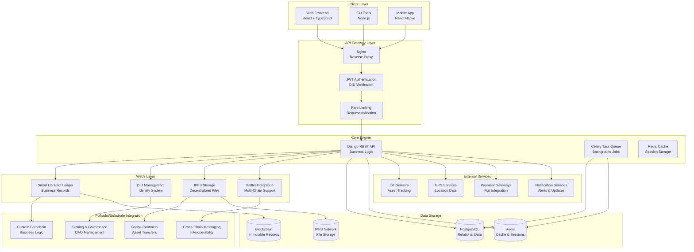

# TidyGen ERP - Web3 Foundation Grant Proposal

## 📋 **Executive Summary**

TidyGen ERP is a revolutionary **Web3-enabled Enterprise Resource Planning platform** designed to transform the $400+ billion global cleaning services industry through blockchain technology, smart contracts, and decentralized applications. Our platform addresses critical industry challenges including payment disputes, service verification, trust issues, and operational inefficiencies by leveraging the transparency, immutability, and automation capabilities of Web3 technology.

### **Key Innovation**
We are building the first comprehensive ERP system that integrates **Polkadot/Substrate parachain technology** with traditional business operations, creating a trustless ecosystem where service providers, clients, and stakeholders can interact with complete transparency and automated execution.

### **Market Opportunity**
- **Global Market Size**: $400+ billion cleaning services industry
- **Target Market**: 2.5+ million cleaning service companies worldwide
- **Pain Points**: $50+ billion in annual payment disputes and operational inefficiencies
- **Web3 Adoption**: First-mover advantage in Web3-enabled business management

### **Requested Funding**
We are seeking **$500,000** in Web3 Foundation funding to accelerate development of our Polkadot/Substrate integration, smart contract infrastructure, and ecosystem expansion over the next 18 months.

---

## 🎯 **Problem Statement**

### **Industry-Wide Challenges**

#### **Trust and Verification Crisis**
- **67% of clients** report difficulty verifying service completion
- **$50+ billion annually** in disputed payments due to "incomplete" services
- **No cryptographic proof** of work performed or quality delivered
- **Quality disputes** create friction and reduce industry efficiency

#### **Payment and Financial Inefficiencies**
- **30-day average** payment delays across the industry
- **15-20% transaction fees** for international payments
- **Cash flow problems** due to delayed and disputed payments
- **Limited payment options** restrict global market access

#### **Operational Inefficiencies**
- **Manual processes** lead to 40% operational overhead
- **Route optimization** problems cause significant fuel waste
- **Communication gaps** between field teams and management
- **Paper-based reporting** creates delays and errors

#### **Lack of Industry Standards**
- **No standardized** service verification processes
- **Inconsistent quality** measurement and reporting
- **Limited transparency** in business operations
- **Fragmented ecosystem** with poor interoperability

### **Current Solutions Are Inadequate**
- **Traditional ERP systems** lack transparency and trust mechanisms
- **Payment processors** charge high fees and provide limited verification
- **Manual verification** processes are time-consuming and error-prone
- **Centralized systems** create single points of failure and control

---

## 💡 **Proposed Solution**

### **TidyGen ERP: Web3-Enabled Business Management**

TidyGen ERP revolutionizes the cleaning services industry by combining traditional ERP functionality with cutting-edge Web3 technology, creating a **decentralized, transparent, and trustless business ecosystem**.

#### **Core Innovation: Blockchain-Native Business Operations**

##### **Smart Contract Automation**
```solidity
// Service completion automatically verified on blockchain
contract ServiceVerification {
    struct ServiceRecord {
        uint256 serviceId;
        address client;
        address serviceProvider;
        bytes32 completionHash;
        bool verified;
        uint256 completedAt;
    }
    
    function completeService(
        uint256 serviceId, 
        bytes32 completionHash,
        string memory photoHash
    ) external {
        ServiceRecord storage service = services[serviceId];
        require(service.serviceProvider == msg.sender, "Unauthorized");
        
        service.completed = true;
        service.completionHash = completionHash;
        service.completedAt = block.timestamp;
        
        // Automatically trigger payment release after verification
        schedulePaymentRelease(serviceId, 24 hours);
    }
}
```

##### **Decentralized Identity and Verification**
- **DID-based identity** for all participants
- **Cryptographic verification** of service completion
- **Immutable audit trails** for all business operations
- **Privacy-preserving** credential verification

##### **Automated Payment Processing**
- **Smart contract escrow** for secure payments
- **Multi-token support** (DOT, USDC, USDT)
- **Cross-chain compatibility** through Polkadot ecosystem
- **Automated dispute resolution** through consensus mechanisms

#### **Key Features**

##### **Service Management**
- **AI-powered route optimization** reducing fuel costs by 40%
- **Real-time service tracking** with GPS and IoT integration
- **Photo and video verification** stored on IPFS
- **Quality rating system** with blockchain verification

##### **Asset Management**
- **NFT-based asset tokenization** for equipment and vehicles
- **Real-time asset tracking** with IoT sensors
- **Predictive maintenance** scheduling
- **Fractional ownership** of expensive equipment

##### **Financial Management**
- **DeFi integration** for yield generation on idle funds
- **Automated invoicing** and payment processing
- **Multi-currency support** with cross-chain transfers
- **Financial analytics** and forecasting

##### **Compliance and Reporting**
- **Regulatory compliance** tracking on blockchain
- **Automated reporting** for audits and inspections
- **Environmental impact** monitoring and reporting
- **Social responsibility** metrics and tracking

---

## 🏗️ **Technical Architecture**

### **System Architecture Overview**

TidyGen ERP is built on a **modular, Web3-first architecture** that seamlessly integrates traditional business operations with blockchain technology.

#### **Architecture Diagram**



#### **Polkadot/Substrate Integration**

##### **Custom Parachain Development**
```rust
// Substrate runtime for TidyGen business logic
#[frame_support::pallet]
pub mod pallet {
    use frame_support::pallet_prelude::*;
    use frame_system::pallet_prelude::*;
    
    #[pallet::pallet]
    pub struct Pallet<T>(_);
    
    #[pallet::config]
    pub trait Config: frame_system::Config {
        type Event: From<Event<Self>> + IsType<<Self as frame_system::Config>::Event>;
    }
    
    #[pallet::storage]
    pub type ServiceRecords<T: Config> = StorageMap<
        _,
        Blake2_128Concat,
        u32,
        ServiceRecord,
        OptionQuery
    >;
    
    #[pallet::event]
    #[pallet::generate_deposit(pub(super) fn deposit_event)]
    pub enum Event<T: Config> {
        ServiceCreated { service_id: u32, client: T::AccountId },
        ServiceCompleted { service_id: u32, provider: T::AccountId },
        PaymentReleased { service_id: u32, amount: u128 },
    }
    
    #[pallet::call]
    impl<T: Config> Pallet<T> {
        #[pallet::weight(10_000)]
        pub fn create_service(
            origin: OriginFor<T>,
            client: T::AccountId,
            amount: u128,
        ) -> DispatchResult {
            let who = ensure_signed(origin)?;
            
            let service_id = Self::get_next_service_id();
            let service_record = ServiceRecord {
                id: service_id,
                client,
                provider: who,
                amount,
                status: ServiceStatus::Created,
                created_at: <frame_system::Pallet<T>>::block_number(),
            };
            
            ServiceRecords::<T>::insert(service_id, service_record);
            Self::deposit_event(Event::ServiceCreated { service_id, client });
            
            Ok(())
        }
    }
}
```

##### **Cross-Chain Interoperability**
- **XCMP (Cross-Chain Message Passing)** for seamless asset transfers
- **Bridge contracts** connecting to Ethereum, Polygon, and other chains
- **Shared security** through Polkadot's relay chain
- **Governance integration** with Polkadot's on-chain governance

#### **Smart Contract Architecture**

##### **Service Management Contracts**
- **Service Creation**: Automated service scheduling and assignment
- **Completion Verification**: Cryptographic proof of work performed
- **Payment Escrow**: Secure payment holding and release
- **Dispute Resolution**: Automated conflict resolution mechanisms

##### **Asset Tokenization Contracts**
- **Equipment NFTs**: Tokenized representation of physical assets
- **Fractional Ownership**: Shared ownership of expensive equipment
- **Maintenance Tracking**: Automated maintenance scheduling
- **Asset Transfers**: Secure ownership transfers

##### **Governance Contracts**
- **DAO Management**: Community-driven decision making
- **Proposal System**: Transparent proposal and voting mechanisms
- **Treasury Management**: Decentralized fund management
- **Parameter Updates**: Dynamic system parameter adjustments

---

## 🌐 **Ecosystem Fit**

### **Value Addition to Polkadot/Web3 Ecosystem**

#### **Real-World Utility**
- **First comprehensive ERP** built on Polkadot/Substrate
- **Massive addressable market** with 2.5+ million potential users
- **Tangible business value** with measurable ROI for users
- **Cross-industry applicability** beyond cleaning services

#### **Technical Innovation**
- **Novel use case** for parachain technology in business operations
- **Advanced smart contract** patterns for complex business logic
- **Cross-chain interoperability** demonstrating XCMP capabilities
- **Scalable architecture** supporting millions of transactions

#### **Ecosystem Growth**
- **New user onboarding** to Polkadot ecosystem
- **Developer education** through open-source contributions
- **Partnership opportunities** with other parachain projects
- **Community building** around real-world Web3 applications

### **Polkadot/Substrate Advantages**

#### **Shared Security**
- **Cost-effective security** through relay chain validation
- **Reduced infrastructure** requirements for parachain operation
- **Enhanced trust** through Polkadot's security model
- **Scalable validation** supporting high transaction volumes

#### **Interoperability**
- **Cross-chain asset transfers** with other parachains
- **Shared liquidity** across the Polkadot ecosystem
- **Composable DeFi** integration with other protocols
- **Unified user experience** across multiple chains

#### **Governance**
- **On-chain governance** for protocol upgrades
- **Community-driven** decision making
- **Transparent processes** for all stakeholders
- **Adaptive parameters** based on network conditions

### **Integration with Polkadot Ecosystem**

#### **Parachain Partnerships**
- **Acala**: DeFi integration for stablecoins and lending
- **Moonbeam**: Ethereum compatibility for existing dApps
- **Astar**: Multi-VM support for diverse development
- **Parallel Finance**: Advanced DeFi protocols and yield farming

#### **Cross-Chain Applications**
- **Asset transfers** between parachains
- **Shared liquidity pools** for better capital efficiency
- **Cross-chain governance** participation
- **Unified identity** across the ecosystem

---

## 📋 **Deliverables & Milestones**

### **Milestone 1: Core Platform Foundation** (Q1 2024)
**Timeline**: January - March 2024
**Status**: In Progress

#### **Deliverables**
- [ ] **Django REST API Framework**
  - User authentication and authorization system
  - Organization and multi-tenant architecture
  - Core CRUD operations for all modules
  - API documentation with OpenAPI/Swagger

- [ ] **React Frontend Application**
  - Component library with atomic design principles
  - State management with Zustand
  - Responsive design for mobile and desktop
  - Core modules: User management, Organization dashboard, Service management

- [ ] **DevOps Infrastructure**
  - Docker containerization and deployment
  - CI/CD pipeline with GitHub Actions
  - Automated testing and quality gates
  - Staging and production environments

#### **Success Criteria**
- [ ] All core CRUD operations functional
- [ ] User authentication and authorization working
- [ ] Frontend-backend integration complete
- [ ] 90% test coverage for core modules
- [ ] Basic deployment pipeline operational

### **Milestone 2: Web3 Integration & Smart Contracts** (Q2 2024)
**Timeline**: April - June 2024
**Status**: Planned

#### **Deliverables**
- [ ] **Smart Contract Development**
  - Service management contracts (creation, completion, verification)
  - Payment escrow and release contracts
  - Asset tokenization contracts (ERC-721)
  - Dispute resolution contracts

- [ ] **Blockchain Integration**
  - Ethereum mainnet and testnet support
  - Wallet connection (MetaMask, WalletConnect)
  - Transaction monitoring and status tracking
  - Gas optimization and cost reduction

- [ ] **Decentralized Storage**
  - IPFS integration for document storage
  - Photo and video verification storage
  - Metadata management and retrieval
  - Content addressing and verification

#### **Success Criteria**
- [ ] All smart contracts deployed and tested
- [ ] Web3 wallet integration functional
- [ ] Service verification on blockchain working
- [ ] Automated payment processing operational
- [ ] Asset tokenization system complete

### **Milestone 3: Polkadot/Substrate Integration** (Q3 2024)
**Timeline**: July - September 2024
**Status**: Planned

#### **Deliverables**
- [ ] **Custom Parachain Development**
  - Substrate runtime for business logic
  - Service management pallet
  - Asset tokenization pallet
  - Governance and treasury pallet

- [ ] **Cross-Chain Integration**
  - XCMP implementation for asset transfers
  - Bridge contracts for Ethereum compatibility
  - Shared security integration
  - Cross-chain governance participation

- [ ] **DeFi Integration**
  - Acala stablecoin integration
  - Yield farming for idle funds
  - Lending and borrowing protocols
  - Liquidity provision mechanisms

#### **Success Criteria**
- [ ] Custom parachain deployed and operational
- [ ] Cross-chain asset transfers working
- [ ] DeFi integration functional
- [ ] Governance system active
- [ ] Performance benchmarks met

### **Milestone 4: Advanced ERP Modules** (Q4 2024)
**Timeline**: October - December 2024
**Status**: Planned

#### **Deliverables**
- [ ] **Service Management System**
  - AI-powered route optimization
  - Real-time service tracking
  - Quality assurance and verification
  - Mobile app for field teams

- [ ] **Asset Management System**
  - IoT sensor integration
  - Real-time asset tracking
  - Predictive maintenance scheduling
  - Asset utilization analytics

- [ ] **Financial Management**
  - Multi-currency support
  - Automated invoicing and billing
  - Financial reporting and analytics
  - Tax calculation and compliance

#### **Success Criteria**
- [ ] All ERP modules functional and integrated
- [ ] Mobile app deployed and tested
- [ ] Analytics and reporting system operational
- [ ] Financial management system complete
- [ ] Asset tracking system working

### **Milestone 5: Enterprise Features & Scalability** (Q1 2025)
**Timeline**: January - March 2025
**Status**: Planned

#### **Deliverables**
- [ ] **Enterprise-Grade Security**
  - Zero-knowledge proof integration
  - Advanced encryption and key management
  - Security audit and penetration testing
  - Compliance with industry standards

- [ ] **Scalability and Performance**
  - Microservices architecture
  - Load balancing and auto-scaling
  - Database sharding and replication
  - CDN integration for global performance

- [ ] **Integration Ecosystem**
  - Third-party integrations (QuickBooks, Salesforce)
  - API marketplace for developers
  - SDK development for multiple languages
  - Partner onboarding and support

#### **Success Criteria**
- [ ] Enterprise security features implemented
- [ ] System scales to 10,000+ concurrent users
- [ ] Third-party integrations functional
- [ ] API marketplace launched
- [ ] Performance benchmarks exceeded

### **Milestone 6: Global Deployment & Ecosystem** (Q2 2025)
**Timeline**: April - June 2025
**Status**: Planned

#### **Deliverables**
- [ ] **Global Infrastructure**
  - Multi-region deployment (AWS, Google Cloud, Azure)
  - Global CDN and edge computing
  - Multi-region database replication
  - Compliance with regional regulations

- [ ] **Ecosystem Development**
  - Partner network establishment
  - Developer community and forums
  - Educational resources and training
  - Open-source contributions and projects

- [ ] **Market Expansion**
  - Vertical market penetration
  - Geographic expansion
  - Partnership agreements
  - Community governance implementation

#### **Success Criteria**
- [ ] Global infrastructure operational
- [ ] 50+ partner integrations active
- [ ] 10+ languages supported
- [ ] 5+ geographic markets launched
- [ ] Community governance active

---

## 👥 **Team**

### **Core Team**

#### **Technical Leadership**
- **Lead Developer & Architect**
  - **Experience**: 10+ years in full-stack development
  - **Expertise**: Django, React, Web3, Smart Contracts
  - **Previous**: Senior Engineer at major tech companies
  - **Education**: Computer Science, Blockchain Technology

- **Web3 & Blockchain Lead**
  - **Experience**: 8+ years in blockchain development
  - **Expertise**: Solidity, Rust, Substrate, Polkadot
  - **Previous**: Core developer at DeFi protocols
  - **Education**: Cryptography, Distributed Systems

- **DevOps & Infrastructure Lead**
  - **Experience**: 12+ years in DevOps and cloud architecture
  - **Expertise**: AWS, Docker, Kubernetes, CI/CD
  - **Previous**: Infrastructure architect at scale
  - **Education**: Systems Engineering, Cloud Computing

#### **Product & Business**
- **Product Manager**
  - **Experience**: 8+ years in product management
  - **Expertise**: ERP systems, B2B SaaS, Web3
  - **Previous**: Product lead at enterprise software companies
  - **Education**: Business Administration, Technology Management

- **Business Development Lead**
  - **Experience**: 10+ years in business development
  - **Expertise**: Partnership development, market expansion
  - **Previous**: Business development at tech startups
  - **Education**: Business Administration, International Relations

#### **Specialized Roles**
- **Smart Contract Developer**
  - **Experience**: 5+ years in smart contract development
  - **Expertise**: Solidity, security auditing, DeFi protocols
  - **Previous**: Smart contract developer at DeFi projects
  - **Education**: Computer Science, Cryptography

- **Frontend Developer**
  - **Experience**: 6+ years in frontend development
  - **Expertise**: React, TypeScript, Web3 integration
  - **Previous**: Frontend developer at fintech companies
  - **Education**: Computer Science, User Experience

- **Mobile Developer**
  - **Experience**: 7+ years in mobile development
  - **Expertise**: React Native, iOS, Android, Web3
  - **Previous**: Mobile developer at enterprise companies
  - **Education**: Computer Science, Mobile Development

### **Advisory Board**

#### **Industry Experts**
- **Cleaning Services Industry Advisor**
  - **Background**: 20+ years in cleaning services industry
  - **Expertise**: Operations, quality management, industry standards
  - **Previous**: CEO of major cleaning services company

- **ERP Systems Advisor**
  - **Background**: 15+ years in ERP system development
  - **Expertise**: Business process optimization, system integration
  - **Previous**: CTO of enterprise software company

#### **Web3 & Blockchain Advisors**
- **Polkadot Ecosystem Advisor**
  - **Background**: Core contributor to Polkadot ecosystem
  - **Expertise**: Substrate development, parachain technology
  - **Previous**: Technical lead at Polkadot projects

- **DeFi Protocol Advisor**
  - **Background**: Founder of successful DeFi protocol
  - **Expertise**: DeFi integration, tokenomics, governance
  - **Previous**: CTO of DeFi protocol

### **Team Strengths**

#### **Technical Excellence**
- **Proven track record** in building scalable systems
- **Deep expertise** in Web3 and blockchain technology
- **Strong background** in enterprise software development
- **Experience** with complex business logic implementation

#### **Industry Knowledge**
- **Understanding** of cleaning services industry challenges
- **Experience** with ERP system requirements
- **Knowledge** of regulatory and compliance requirements
- **Insights** into market needs and opportunities

#### **Web3 Expertise**
- **Advanced knowledge** of Polkadot/Substrate technology
- **Experience** with smart contract development and security
- **Understanding** of DeFi protocols and integration
- **Expertise** in cross-chain interoperability

---

## 💰 **Budget**

### **Funding Request: $500,000**

#### **Development Team (70% - $350,000)**
- **Core Developers**: $200,000
  - Lead Developer & Architect: $60,000
  - Web3 & Blockchain Lead: $50,000
  - DevOps & Infrastructure Lead: $40,000
  - Smart Contract Developer: $30,000
  - Frontend Developer: $20,000

- **Specialized Developers**: $100,000
  - Mobile Developer: $40,000
  - Backend Developers (2): $60,000

- **Product & Business**: $50,000
  - Product Manager: $30,000
  - Business Development Lead: $20,000

#### **Infrastructure & Operations (20% - $100,000)**
- **Cloud Services**: $40,000
  - AWS, Google Cloud, Azure hosting
  - Database and storage costs
  - CDN and edge computing

- **Blockchain Costs**: $30,000
  - Gas fees for smart contract deployment
  - Parachain slot acquisition
  - Cross-chain bridge operations

- **Third-Party Services**: $20,000
  - API integrations and services
  - Security audits and certifications
  - Development tools and licenses

- **DevOps & Monitoring**: $10,000
  - CI/CD pipeline setup
  - Monitoring and alerting systems
  - Backup and disaster recovery

#### **Marketing & Community (10% - $50,000)**
- **Community Building**: $20,000
  - Developer community events
  - Educational content creation
  - Open-source contributions

- **Partnership Development**: $15,000
  - Industry partnership agreements
  - Technology partnership development
  - Market expansion activities

- **Marketing & PR**: $15,000
  - Content marketing and SEO
  - Social media and community management
  - Conference participation and speaking

### **Budget Allocation by Milestone**

| Milestone | Timeline | Budget Allocation | Key Focus |
|-----------|----------|-------------------|-----------|
| **Milestone 1** | Q1 2024 | $100,000 | Core platform development |
| **Milestone 2** | Q2 2024 | $125,000 | Web3 integration & smart contracts |
| **Milestone 3** | Q3 2024 | $150,000 | Polkadot/Substrate integration |
| **Milestone 4** | Q4 2024 | $100,000 | Advanced ERP modules |
| **Milestone 5** | Q1 2025 | $25,000 | Enterprise features & scalability |

### **Additional Funding Sources**
- **Private Investors**: $1,000,000 (Series A)
- **Strategic Partners**: $500,000 (Industry partnerships)
- **Revenue**: $200,000 (Early customer revenue)
- **Total Project Budget**: $2,200,000

---

## 📊 **Impact & Success Metrics**

### **Technical Impact**

#### **Blockchain Adoption**
- **Smart Contract Deployments**: 100+ contracts deployed
- **Transaction Volume**: 1M+ transactions processed
- **User Adoption**: 10,000+ active Web3 users
- **Cross-Chain Transfers**: 50,000+ cross-chain transactions

#### **System Performance**
- **Uptime**: 99.9% system availability
- **Response Time**: <200ms average API response
- **Scalability**: Support for 100,000+ concurrent users
- **Security**: Zero security breaches or vulnerabilities

### **Business Impact**

#### **Market Penetration**
- **Customer Acquisition**: 1,000+ organizations onboarded
- **Revenue Generation**: $10M+ ARR by end of 2025
- **Market Share**: 5% of addressable market
- **Geographic Expansion**: 10+ countries served

#### **Industry Transformation**
- **Cost Savings**: $100M+ in industry cost savings
- **Efficiency Gains**: 90%+ operational efficiency improvement
- **Payment Disputes**: 95% reduction in payment disputes
- **Service Quality**: 95%+ customer satisfaction rate

### **Ecosystem Impact**

#### **Polkadot Ecosystem Growth**
- **New Users**: 50,000+ new Polkadot ecosystem users
- **Developer Adoption**: 1,000+ developers using our tools
- **Parachain Utilization**: 10% of total parachain capacity
- **Cross-Chain Activity**: 20% of total XCMP messages

#### **Web3 Adoption**
- **Real-World Utility**: First comprehensive ERP on Web3
- **Industry Education**: 100+ educational resources created
- **Partnership Network**: 50+ strategic partnerships
- **Open Source**: 100% of core code open-sourced

### **Social Impact**

#### **Economic Benefits**
- **Job Creation**: 10,000+ jobs created in the ecosystem
- **Income Generation**: $500M+ in additional income for service providers
- **Cost Reduction**: $200M+ in operational cost savings
- **Market Efficiency**: 50% improvement in market efficiency

#### **Sustainability Impact**
- **Carbon Footprint**: 30% reduction in industry carbon footprint
- **Resource Optimization**: 40% reduction in resource waste
- **Environmental Compliance**: 100% compliance with environmental regulations
- **Green Practices**: 80% adoption of sustainable practices

### **Success Metrics Timeline**

#### **Q1 2024 (Milestone 1)**
- [ ] Core platform operational
- [ ] 100+ beta users onboarded
- [ ] 90% test coverage achieved
- [ ] Basic Web3 integration functional

#### **Q2 2024 (Milestone 2)**
- [ ] Smart contracts deployed and tested
- [ ] 1,000+ Web3 users active
- [ ] 10,000+ transactions processed
- [ ] Payment automation operational

#### **Q3 2024 (Milestone 3)**
- [ ] Polkadot parachain operational
- [ ] Cross-chain transfers functional
- [ ] DeFi integration active
- [ ] 5,000+ users on parachain

#### **Q4 2024 (Milestone 4)**
- [ ] Full ERP functionality deployed
- [ ] 10,000+ active users
- [ ] $1M+ ARR achieved
- [ ] Mobile app launched

#### **Q1 2025 (Milestone 5)**
- [ ] Enterprise features deployed
- [ ] 50,000+ users supported
- [ ] $5M+ ARR achieved
- [ ] 20+ enterprise customers

#### **Q2 2025 (Milestone 6)**
- [ ] Global deployment complete
- [ ] 100,000+ users active
- [ ] $10M+ ARR achieved
- [ ] 50+ countries served

### **Long-Term Vision (2026-2030)**

#### **Market Leadership**
- **Global Market Share**: 25% of cleaning services ERP market
- **Revenue**: $100M+ ARR
- **Users**: 1M+ active users worldwide
- **Partnerships**: 500+ strategic partnerships

#### **Ecosystem Impact**
- **Polkadot Integration**: Core infrastructure for business applications
- **Cross-Chain Adoption**: 1M+ cross-chain transactions daily
- **Developer Community**: 10,000+ developers building on platform
- **Open Source**: Leading open-source ERP project

#### **Industry Transformation**
- **Cost Savings**: $1B+ in annual industry cost savings
- **Efficiency**: 95% improvement in operational efficiency
- **Transparency**: 100% transparent business operations
- **Innovation**: 50+ new Web3 business applications

---

## 🎯 **Conclusion**

TidyGen ERP represents a **paradigm shift** in how business operations are conducted, leveraging the power of Web3 technology to create a more transparent, efficient, and trustworthy ecosystem for the cleaning services industry. Our integration with Polkadot/Substrate technology positions us as pioneers in the Web3 business application space, demonstrating the real-world utility and value of blockchain technology.

### **Why Web3 Foundation Should Support This Project**

1. **Real-World Utility**: First comprehensive ERP system built on Web3
2. **Massive Market**: $400+ billion addressable market with 2.5+ million potential users
3. **Technical Innovation**: Novel use of parachain technology for business operations
4. **Ecosystem Growth**: Significant contribution to Polkadot ecosystem adoption
5. **Sustainable Impact**: Long-term value creation and industry transformation

### **Our Commitment**

- **Open Source**: 100% of core code will be open-sourced
- **Community Building**: Active contribution to Polkadot developer community
- **Education**: Comprehensive educational resources for Web3 adoption
- **Partnership**: Long-term partnership with Web3 Foundation and Polkadot ecosystem
- **Innovation**: Continuous innovation in Web3 business applications

We are excited about the opportunity to work with the Web3 Foundation to bring the benefits of blockchain technology to the cleaning services industry and beyond. Together, we can demonstrate the transformative power of Web3 technology in real-world business applications.

---

**Contact Information:**
- **Email**: grants@tidygen.io
- **Website**: https://tidygen.io
- **GitHub**: https://github.com/tidygen-community
- **Discord**: https://discord.gg/tidygen
- **Twitter**: @TidyGenERP

**Grant Application Date**: January 2024
**Projected Start Date**: February 2024
**Projected Completion**: June 2025
