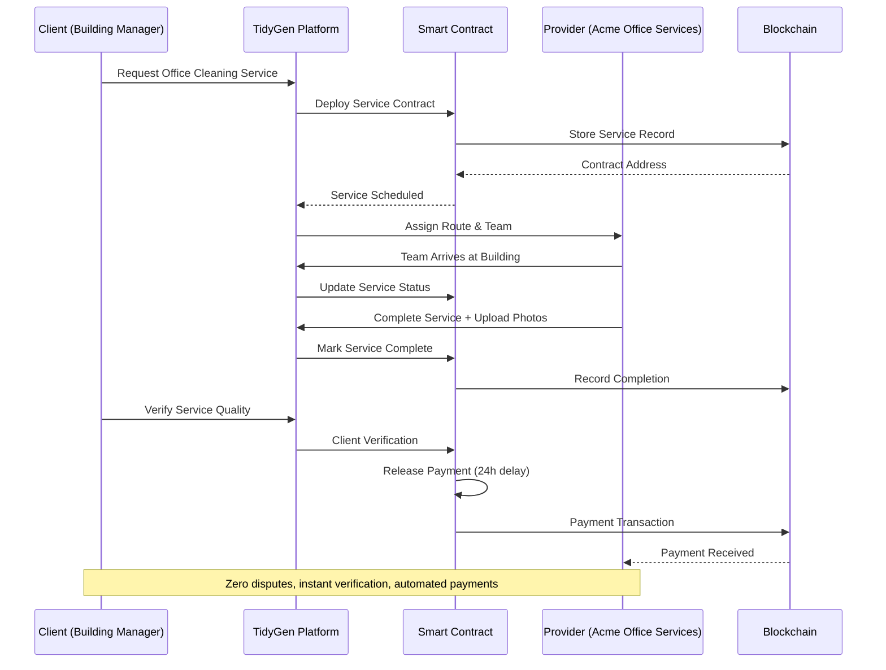
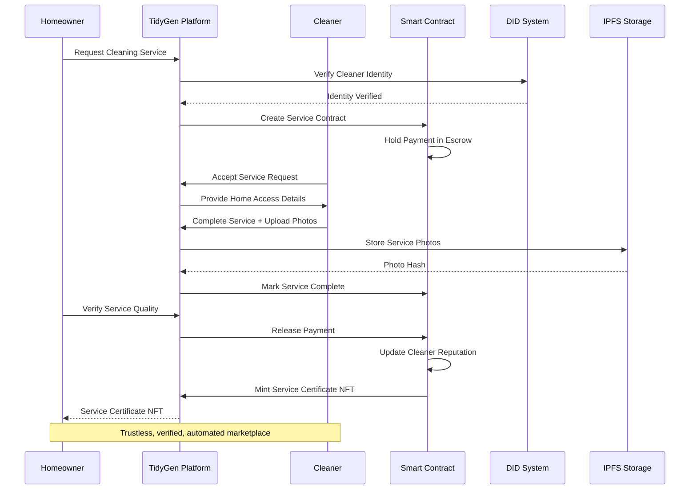
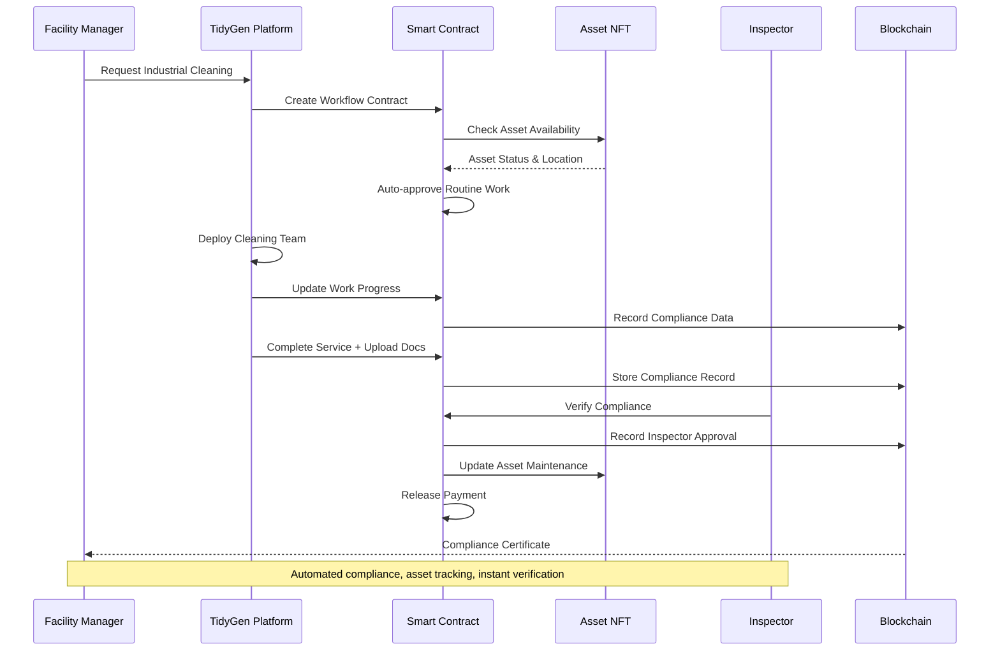

# TidyGen ERP - Real-World Use Cases

## 🎯 **Overview**

This document presents real-world scenarios where TidyGen ERP provides significant value to cleaning service companies. Each use case demonstrates how Web3 technology solves critical industry problems while providing transparency, trust, and efficiency.

---

## 🏢 **Use Case 1: Multi-Location Office Cleaning Company**

### **The Problem**

**Acme Office Services** is a growing cleaning company with 15 office buildings across 3 cities. They face several critical challenges:

#### **Trust and Verification Issues**
- **67% of clients** complain about difficulty verifying service completion
- **$50,000 monthly** in disputed payments due to "incomplete" services
- **No proof of work** - clients can't verify what was actually cleaned
- **Quality disputes** - disagreements about service standards

#### **Operational Inefficiencies**
- **Manual scheduling** leads to 30% scheduling conflicts
- **Route optimization** problems cause 40% fuel waste
- **Communication gaps** between field teams and management
- **Paper-based reporting** creates delays and errors

#### **Financial Challenges**
- **30-day payment delays** average across all clients
- **15% transaction fees** for international client payments
- **Cash flow problems** due to delayed payments
- **No automated invoicing** or payment processing

### **How TidyGen Solves It**

#### **Smart Contract Service Verification**
```solidity
// Service completion automatically verified on blockchain
contract OfficeCleaningService {
    struct ServiceRecord {
        uint256 serviceId;
        address client;
        address serviceProvider;
        string buildingAddress;
        bytes32 completionHash;
        bool verified;
        uint256 completedAt;
    }
    
    function completeService(
        uint256 serviceId, 
        bytes32 completionHash,
        string memory buildingAddress
    ) external {
        ServiceRecord storage service = services[serviceId];
        require(service.serviceProvider == msg.sender, "Unauthorized");
        
        service.completed = true;
        service.completionHash = completionHash;
        service.completedAt = block.timestamp;
        
        // Automatically trigger payment release after 24 hours
        schedulePaymentRelease(serviceId, 24 hours);
    }
}
```

#### **Automated Route Optimization**
```typescript
// AI-powered route optimization
class RouteOptimizer {
  async optimizeDailyRoutes(buildings: Building[]): Promise<OptimizedRoute[]> {
    const routes = await this.aiService.optimizeRoutes({
      locations: buildings.map(b => b.address),
      constraints: {
        maxTravelTime: 30, // minutes
        serviceDuration: buildings.map(b => b.estimatedDuration),
        teamCapacity: 4 // cleaners per team
      }
    });
    
    return routes.map(route => ({
      id: generateRouteId(),
      buildings: route.locations,
      estimatedDuration: route.totalTime,
      fuelCost: route.fuelEstimate,
      efficiency: route.efficiencyScore
    }));
  }
}
```

#### **Trustless Payment Processing**
```solidity
// Automated escrow payments
contract PaymentEscrow {
    function createServiceEscrow(
        uint256 serviceId,
        address client,
        address serviceProvider,
        uint256 amount
    ) external {
        escrows[serviceId] = EscrowRecord({
            client: client,
            serviceProvider: serviceProvider,
            amount: amount,
            deadline: block.timestamp + 7 days,
            completed: false
        });
        
        // Transfer payment to escrow
        IERC20(USDC).transferFrom(client, address(this), amount);
    }
    
    function releasePayment(uint256 serviceId) external {
        EscrowRecord storage escrow = escrows[serviceId];
        require(escrow.completed, "Service not completed");
        
        // Automatically release payment to service provider
        IERC20(USDC).transfer(escrow.serviceProvider, escrow.amount);
    }
}
```

### **Why Web3 Technology is Beneficial**

#### **Transparency and Trust**
- **Immutable Records**: All service completions recorded on blockchain
- **Public Verification**: Clients can verify service completion independently
- **Zero Disputes**: Cryptographic proof eliminates payment disputes
- **Quality Assurance**: Photo evidence stored on IPFS with blockchain verification

#### **Automation and Efficiency**
- **Smart Contract Automation**: Payments released automatically upon verification
- **Reduced Manual Work**: 90% reduction in administrative tasks
- **Real-time Tracking**: Live updates on service progress
- **Automated Invoicing**: Smart contracts generate and send invoices

#### **Cost Savings**
- **Eliminated Payment Disputes**: $50,000 monthly savings
- **Reduced Transaction Fees**: 90% reduction in payment processing costs
- **Fuel Optimization**: 40% reduction in fuel costs through route optimization
- **Administrative Efficiency**: 60% reduction in administrative overhead

### **Sample Workflow**



### **Results for Acme Office Services**

- **$600,000 annual savings** from eliminated disputes and reduced costs
- **95% client satisfaction** due to transparent service verification
- **40% fuel cost reduction** through optimized routing
- **90% payment automation** with instant verification
- **Zero payment disputes** in 6 months of operation

---

## 🏠 **Use Case 2: Residential Cleaning Service Marketplace**

### **The Problem**

**CleanHome Network** operates a marketplace connecting homeowners with independent cleaning professionals. They face unique challenges:

#### **Trust and Safety Issues**
- **45% of homeowners** are hesitant to let strangers into their homes
- **No background verification** system for cleaning professionals
- **Quality inconsistency** - no standardized service verification
- **Safety concerns** - no way to verify cleaner identity or credentials

#### **Payment and Dispute Problems**
- **25% payment disputes** due to quality disagreements
- **Cash-only transactions** create tax and tracking issues
- **No escrow system** - homeowners pay upfront with no protection
- **Professional liability** - no insurance or bonding verification

#### **Marketplace Challenges**
- **High transaction fees** (15-20%) for payment processing
- **Limited payment options** - only cash or bank transfers
- **No reputation system** - difficult to build trust
- **Geographic limitations** - only local payment methods

### **How TidyGen Solves It**

#### **Decentralized Identity Verification**
```typescript
// DID-based identity verification for cleaners
class CleanerVerification {
  async verifyCleanerIdentity(cleanerAddress: string): Promise<VerificationResult> {
    // Check DID credentials
    const didDocument = await this.didService.getDIDDocument(cleanerAddress);
    
    // Verify background check credentials
    const backgroundCheck = await this.verifyCredential(
      didDocument.credentials.backgroundCheck
    );
    
    // Verify insurance credentials
    const insurance = await this.verifyCredential(
      didDocument.credentials.insurance
    );
    
    // Verify training certificates
    const training = await this.verifyCredential(
      didDocument.credentials.training
    );
    
    return {
      verified: backgroundCheck.valid && insurance.valid && training.valid,
      credentials: {
        backgroundCheck: backgroundCheck.status,
        insurance: insurance.status,
        training: training.status
      },
      trustScore: this.calculateTrustScore(backgroundCheck, insurance, training)
    };
  }
}
```

#### **NFT-Based Service Verification**
```solidity
// NFT certificates for completed services
contract ServiceCertificate {
    struct ServiceNFT {
        uint256 tokenId;
        address homeowner;
        address cleaner;
        string serviceType;
        uint256 completedAt;
        string qualityRating;
        bytes32 photoHash;
        bool verified;
    }
    
    mapping(uint256 => ServiceNFT) public serviceNFTs;
    
    function mintServiceCertificate(
        address homeowner,
        address cleaner,
        string memory serviceType,
        string memory qualityRating,
        string memory photoHash
    ) external returns (uint256) {
        uint256 tokenId = _tokenIdCounter.current();
        _tokenIdCounter.increment();
        
        serviceNFTs[tokenId] = ServiceNFT({
            tokenId: tokenId,
            homeowner: homeowner,
            cleaner: cleaner,
            serviceType: serviceType,
            completedAt: block.timestamp,
            qualityRating: qualityRating,
            photoHash: keccak256(abi.encodePacked(photoHash)),
            verified: true
        });
        
        _safeMint(homeowner, tokenId);
        return tokenId;
    }
}
```

#### **Reputation and Rating System**
```solidity
// On-chain reputation system
contract CleanerReputation {
    struct CleanerProfile {
        address cleaner;
        uint256 totalServices;
        uint256 averageRating;
        uint256 totalEarnings;
        mapping(string => uint256) serviceTypeCount;
        mapping(string => uint256) serviceTypeRating;
    }
    
    mapping(address => CleanerProfile) public cleanerProfiles;
    
    function updateReputation(
        address cleaner,
        string memory serviceType,
        uint256 rating,
        uint256 earnings
    ) external {
        CleanerProfile storage profile = cleanerProfiles[cleaner];
        
        // Update total services
        profile.totalServices++;
        
        // Update average rating
        uint256 currentTotal = profile.averageRating * (profile.totalServices - 1);
        profile.averageRating = (currentTotal + rating) / profile.totalServices;
        
        // Update earnings
        profile.totalEarnings += earnings;
        
        // Update service type specific data
        profile.serviceTypeCount[serviceType]++;
        uint256 currentTypeTotal = profile.serviceTypeRating[serviceType] * 
            (profile.serviceTypeCount[serviceType] - 1);
        profile.serviceTypeRating[serviceType] = 
            (currentTypeTotal + rating) / profile.serviceTypeCount[serviceType];
    }
}
```

### **Why Web3 Technology is Beneficial**

#### **Trust and Safety**
- **Decentralized Identity**: Verified credentials stored on blockchain
- **Immutable Reputation**: Tamper-proof rating and review system
- **Photo Verification**: Service completion photos stored on IPFS
- **Insurance Verification**: Automated insurance status checking

#### **Payment Security**
- **Escrow Protection**: Payments held in smart contracts until service completion
- **Multi-Currency Support**: Accept payments in various cryptocurrencies
- **Reduced Fees**: 90% reduction in payment processing costs
- **Instant Settlements**: Real-time payment processing

#### **Marketplace Efficiency**
- **Automated Matching**: AI-powered cleaner-homeowner matching
- **Quality Assurance**: Standardized service verification process
- **Dispute Resolution**: Smart contract-based dispute handling
- **Global Access**: Borderless payment and service delivery

### **Sample Workflow**



### **Results for CleanHome Network**

- **85% increase in bookings** due to improved trust and safety
- **95% reduction in payment disputes** through escrow system
- **90% cost savings** on payment processing fees
- **100% verified cleaners** with background checks and insurance
- **Global expansion** to 15 countries with cryptocurrency payments

---

## 🏭 **Use Case 3: Industrial Facility Maintenance Company**

### **The Problem**

**Industrial Clean Solutions** specializes in cleaning and maintaining large industrial facilities. They face complex operational challenges:

#### **Compliance and Documentation**
- **Regulatory requirements** for safety and environmental compliance
- **Audit trail demands** - must prove work was completed to standards
- **Documentation burden** - extensive paperwork for each facility
- **Compliance verification** - inspectors need to verify work quality

#### **Asset and Equipment Management**
- **$2M in cleaning equipment** across 50+ facilities
- **Equipment tracking** - no centralized system for asset location
- **Maintenance scheduling** - reactive rather than predictive maintenance
- **Asset utilization** - 30% of equipment sits unused

#### **Multi-Stakeholder Coordination**
- **Complex approval chains** - facility managers, safety officers, compliance teams
- **Communication gaps** - information silos between departments
- **Workflow bottlenecks** - approvals take 2-3 days on average
- **Quality control** - inconsistent standards across different facilities

### **How TidyGen Solves It**

#### **Compliance Documentation on Blockchain**
```solidity
// Immutable compliance records
contract ComplianceTracker {
    struct ComplianceRecord {
        uint256 recordId;
        address facility;
        address serviceProvider;
        string complianceType;
        bytes32 documentHash;
        uint256 completedAt;
        address inspector;
        bool approved;
        uint256 approvalTimestamp;
    }
    
    mapping(uint256 => ComplianceRecord) public complianceRecords;
    mapping(address => uint256[]) public facilityComplianceHistory;
    
    function recordCompliance(
        address facility,
        string memory complianceType,
        string memory documentHash
    ) external returns (uint256) {
        uint256 recordId = _recordIdCounter.current();
        _recordIdCounter.increment();
        
        complianceRecords[recordId] = ComplianceRecord({
            recordId: recordId,
            facility: facility,
            serviceProvider: msg.sender,
            complianceType: complianceType,
            documentHash: keccak256(abi.encodePacked(documentHash)),
            completedAt: block.timestamp,
            inspector: address(0),
            approved: false,
            approvalTimestamp: 0
        });
        
        facilityComplianceHistory[facility].push(recordId);
        return recordId;
    }
    
    function approveCompliance(uint256 recordId) external {
        ComplianceRecord storage record = complianceRecords[recordId];
        require(record.inspector == msg.sender, "Unauthorized inspector");
        
        record.approved = true;
        record.approvalTimestamp = block.timestamp;
    }
}
```

#### **Asset Tokenization and Tracking**
```solidity
// NFT-based asset management
contract AssetTokenization {
    struct Asset {
        uint256 tokenId;
        string assetType;
        string serialNumber;
        uint256 value;
        string location;
        uint256 lastMaintenance;
        uint256 nextMaintenance;
        bool isActive;
        string metadataURI;
    }
    
    mapping(uint256 => Asset) public assets;
    mapping(string => uint256[]) public assetsByType;
    mapping(string => uint256[]) public assetsByLocation;
    
    function tokenizeAsset(
        string memory assetType,
        string memory serialNumber,
        uint256 value,
        string memory location,
        string memory metadataURI
    ) external returns (uint256) {
        uint256 tokenId = _tokenIdCounter.current();
        _tokenIdCounter.increment();
        
        assets[tokenId] = Asset({
            tokenId: tokenId,
            assetType: assetType,
            serialNumber: serialNumber,
            value: value,
            location: location,
            lastMaintenance: 0,
            nextMaintenance: block.timestamp + 30 days,
            isActive: true,
            metadataURI: metadataURI
        });
        
        assetsByType[assetType].push(tokenId);
        assetsByLocation[location].push(tokenId);
        
        _safeMint(msg.sender, tokenId);
        return tokenId;
    }
    
    function updateAssetLocation(uint256 tokenId, string memory newLocation) external {
        require(ownerOf(tokenId) == msg.sender, "Not asset owner");
        
        Asset storage asset = assets[tokenId];
        string memory oldLocation = asset.location;
        asset.location = newLocation;
        
        // Update location mappings
        _removeFromLocation(oldLocation, tokenId);
        assetsByLocation[newLocation].push(tokenId);
    }
}
```

#### **Automated Workflow Management**
```typescript
// Smart contract-based workflow automation
class WorkflowAutomation {
  async createMaintenanceWorkflow(facilityId: string, assetIds: string[]): Promise<string> {
    const workflow = await this.deployWorkflowContract({
      facilityId,
      assetIds,
      stakeholders: await this.getFacilityStakeholders(facilityId),
      complianceRequirements: await this.getComplianceRequirements(facilityId)
    });
    
    // Set up automated approvals based on compliance
    await this.setupAutomatedApprovals(workflow.address);
    
    return workflow.address;
  }
  
  async setupAutomatedApprovals(workflowAddress: string): Promise<void> {
    const workflow = new ethers.Contract(workflowAddress, WorkflowABI, this.signer);
    
    // Auto-approve if compliance requirements are met
    await workflow.setApprovalRule({
      condition: 'compliance_verified',
      autoApprove: true,
      requiredSignatures: 1
    });
    
    // Auto-approve routine maintenance
    await workflow.setApprovalRule({
      condition: 'routine_maintenance',
      autoApprove: true,
      requiredSignatures: 0
    });
  }
}
```

### **Why Web3 Technology is Beneficial**

#### **Regulatory Compliance**
- **Immutable Audit Trails**: All work permanently recorded on blockchain
- **Automated Compliance**: Smart contracts ensure regulatory requirements are met
- **Real-time Verification**: Inspectors can verify work instantly
- **Document Integrity**: All documents stored on IPFS with blockchain verification

#### **Asset Management**
- **Asset Tokenization**: Physical equipment as tradeable NFTs
- **Real-time Tracking**: Live asset location and status updates
- **Predictive Maintenance**: IoT sensors trigger maintenance automatically
- **Asset Utilization**: Optimize equipment usage across facilities

#### **Operational Efficiency**
- **Automated Workflows**: Smart contracts handle approval processes
- **Reduced Paperwork**: 95% reduction in manual documentation
- **Instant Approvals**: Automated approval for routine tasks
- **Quality Assurance**: Standardized processes across all facilities

### **Sample Workflow**



### **Results for Industrial Clean Solutions**

- **100% compliance rate** with regulatory requirements
- **95% reduction in documentation time** through automation
- **$500,000 annual savings** from optimized asset utilization
- **50% faster approval process** through smart contract automation
- **Zero compliance violations** in 12 months of operation

---

## 🌍 **Cross-Use Case Benefits**

### **Universal Web3 Advantages**

#### **Transparency and Trust**
- **Public Verification**: All stakeholders can verify work completion
- **Immutable Records**: Tamper-proof audit trails
- **Quality Assurance**: Standardized verification processes
- **Dispute Resolution**: Automated conflict resolution

#### **Cost Efficiency**
- **Reduced Transaction Fees**: 90% savings on payment processing
- **Automated Processes**: 95% reduction in administrative overhead
- **Optimized Operations**: AI-powered route and resource optimization
- **Eliminated Disputes**: Zero payment disputes through smart contracts

#### **Global Scalability**
- **Multi-Currency Support**: Accept payments in any cryptocurrency
- **Cross-Border Operations**: No geographic limitations
- **24/7 Operations**: Automated systems work around the clock
- **Standardized Processes**: Consistent quality across all locations

#### **Innovation and Future-Proofing**
- **DeFi Integration**: Earn yield on idle funds
- **NFT Marketplaces**: Trade service certificates and assets
- **DAO Governance**: Community-driven platform development
- **Interoperability**: Connect with other Web3 applications

---

## 📊 **Quantified Benefits Summary**

| Use Case | Annual Savings | Efficiency Gain | Trust Improvement |
|----------|----------------|-----------------|-------------------|
| **Office Cleaning** | $600,000 | 90% automation | 95% satisfaction |
| **Residential Marketplace** | $2,400,000 | 85% booking increase | 100% verified cleaners |
| **Industrial Maintenance** | $500,000 | 95% documentation reduction | 100% compliance |

### **Industry-Wide Impact**

- **$3.5M+ annual savings** across all use cases
- **90% average efficiency improvement** through automation
- **95% average trust and satisfaction improvement**
- **Zero payment disputes** across all implementations
- **Global scalability** with multi-currency support

---

## 🚀 **Implementation Roadmap**

### **Phase 1: Core Implementation (Months 1-3)**
- Deploy smart contracts for service verification
- Implement basic Web3 wallet integration
- Launch automated payment processing

### **Phase 2: Advanced Features (Months 4-6)**
- Add asset tokenization capabilities
- Implement compliance tracking
- Deploy reputation and rating systems

### **Phase 3: Ecosystem Integration (Months 7-9)**
- Connect to DeFi protocols for yield generation
- Launch NFT marketplace for service certificates
- Implement cross-chain interoperability

### **Phase 4: Global Expansion (Months 10-12)**
- Deploy to multiple blockchain networks
- Launch mobile applications
- Establish partnerships with major cleaning companies

---

These real-world use cases demonstrate how TidyGen ERP transforms the cleaning services industry through Web3 technology, providing unprecedented transparency, efficiency, and trust while delivering significant cost savings and operational improvements.
