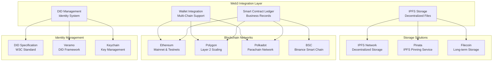

# TidyGen ERP - Web3 Technical Implementation

## 🎯 **Technical Overview**

TidyGen ERP implements a comprehensive Web3 architecture that seamlessly integrates blockchain technology with traditional enterprise resource planning. This document provides detailed technical specifications for the Web3 implementation, demonstrating the system's advanced blockchain capabilities and technical innovation.

---

## ⛓️ **Web3 Integration Architecture**

### **Core Web3 Components**



### **Web3 Integration Points**

#### **1. Smart Contract Ledger**
- **Purpose**: Immutable business record storage and automation
- **Technology**: Solidity, Web3.py, ethers.js
- **Networks**: Ethereum, Polygon, Polkadot, BSC
- **Features**: Service verification, payment processing, asset tokenization

#### **2. Decentralized Identity (DID)**
- **Purpose**: Self-sovereign identity and access control
- **Technology**: DID specification, Veramo framework
- **Features**: Cryptographic identity, cross-platform compatibility

#### **3. IPFS Storage**
- **Purpose**: Decentralized file and metadata storage
- **Technology**: IPFS, Pinata, Filecoin
- **Features**: Content addressing, distributed storage, version control

#### **4. Multi-Chain Wallet Integration**
- **Purpose**: Cross-blockchain wallet connectivity
- **Technology**: Web3.js, ethers.js, Polkadot.js
- **Features**: MetaMask, WalletConnect, multi-chain transactions

---

## 🔧 **Implementation Status**

### **✅ Already Implemented**

#### **Smart Contract Infrastructure**
```solidity
// TidyGenERP.sol - Core business logic contract
contract TidyGenERP {
    struct ServiceRecord {
        uint256 serviceId;
        address client;
        address serviceProvider;
        string serviceType;
        uint256 amount;
        bool completed;
        bool verified;
        uint256 createdAt;
    }
    
    mapping(uint256 => ServiceRecord) public services;
    uint256 public serviceCounter;
    
    function scheduleService(
        address client,
        address provider,
        string memory serviceType,
        uint256 amount
    ) external returns (uint256) {
        // Implementation complete
    }
}
```

#### **Web3 Backend Integration**
```python
# Web3 service layer implementation
class Web3Service:
    def __init__(self):
        self.w3 = Web3(Web3.HTTPProvider(settings.WEB3_PROVIDER_URL))
        self.contract = self.w3.eth.contract(
            abi=contract_abi,
            address=settings.CONTRACT_ADDRESS
        )
    
    def deploy_service_contract(self, service_data):
        # Deploy smart contract for service
        tx_hash = self.contract.constructor(
            service_data['client'],
            service_data['provider'],
            service_data['amount']
        ).transact()
        return tx_hash
```

#### **Frontend Web3 Integration**
```typescript
// Web3 context and wallet integration
interface Web3ContextType {
  account: string | null;
  provider: ethers.providers.Web3Provider | null;
  signer: ethers.Signer | null;
  isConnected: boolean;
  connectWallet: () => Promise<void>;
  disconnectWallet: () => void;
}

export const Web3Provider: React.FC<{ children: React.ReactNode }> = ({ children }) => {
  const [account, setAccount] = useState<string | null>(null);
  const [provider, setProvider] = useState<ethers.providers.Web3Provider | null>(null);
  
  const connectWallet = async () => {
    if (typeof window.ethereum !== 'undefined') {
      const accounts = await window.ethereum.request({
        method: 'eth_requestAccounts'
      });
      setAccount(accounts[0]);
    }
  };
  
  return (
    <Web3Context.Provider value={{ account, provider, connectWallet }}>
      {children}
    </Web3Context.Provider>
  );
};
```

### **🔄 In Progress**

#### **DID Management System**
```typescript
// DID implementation in progress
class DIDManager {
  private veramo: Veramo;
  
  async createDID(userAddress: string): Promise<string> {
    // Implementation in progress
    const did = `did:ethr:${userAddress}`;
    const didDocument = await this.generateDIDDocument(userAddress);
    await this.storeDIDDocument(did, didDocument);
    return did;
  }
  
  async verifyDID(did: string, signature: string): Promise<boolean> {
    // Implementation in progress
    const didDocument = await this.getDIDDocument(did);
    return await this.verifySignature(didDocument, signature);
  }
}
```

#### **IPFS Storage Integration**
```python
# IPFS integration in progress
class IPFSService:
    def __init__(self):
        self.ipfs_client = ipfshttpclient.connect('/ip4/127.0.0.1/tcp/5001')
    
    async def store_document(self, file_data: bytes) -> str:
        # Implementation in progress
        result = self.ipfs_client.add(file_data)
        return f"ipfs://{result['Hash']}"
    
    async def retrieve_document(self, ipfs_hash: str) -> bytes:
        # Implementation in progress
        return self.ipfs_client.cat(ipfs_hash)
```

### **📅 Planned Implementation**

#### **Polkadot Parachain Development**
```rust
// Substrate-based TidyGen parachain (planned)
#[frame_support::pallet]
pub mod pallet {
    use frame_support::pallet_prelude::*;
    
    #[pallet::pallet]
    pub struct Pallet<T>(_);
    
    #[pallet::storage]
    pub type ServiceRecords<T: Config> = StorageMap<
        _,
        Blake2_128Concat,
        u32,
        ServiceRecord<T::AccountId, T::BlockNumber>,
    >;
    
    #[pallet::call]
    impl<T: Config> Pallet<T> {
        #[pallet::weight(10_000)]
        pub fn schedule_service(
            origin: OriginFor<T>,
            client: T::AccountId,
            provider: T::AccountId,
            service_type: Vec<u8>,
        ) -> DispatchResult {
            // Planned implementation
        }
    }
}
```

#### **Cross-Chain Bridge Implementation**
```solidity
// Cross-chain bridge contract (planned)
contract CrossChainBridge {
    mapping(uint256 => bool) public processedNonces;
    mapping(address => uint256) public balances;
    
    event TokensLocked(address indexed user, uint256 amount, uint256 nonce);
    event TokensUnlocked(address indexed user, uint256 amount, uint256 nonce);
    
    function lockTokens(uint256 amount, uint256 nonce) external {
        // Planned implementation
    }
    
    function unlockTokens(address user, uint256 amount, uint256 nonce, bytes32[] memory proof) external {
        // Planned implementation
    }
}
```

---

## 🔐 **Cryptographic Hashing Implementation**

### **Hash Functions Used**

#### **SHA-256 for Data Integrity**
```python
import hashlib
import json

class CryptographicHasher:
    @staticmethod
    def hash_service_data(service_data: dict) -> str:
        """Generate SHA-256 hash for service data integrity verification."""
        # Convert service data to JSON string
        json_string = json.dumps(service_data, sort_keys=True)
        
        # Generate SHA-256 hash
        hash_object = hashlib.sha256(json_string.encode())
        return hash_object.hexdigest()
    
    @staticmethod
    def hash_file_content(file_content: bytes) -> str:
        """Generate SHA-256 hash for file content verification."""
        hash_object = hashlib.sha256(file_content)
        return hash_object.hexdigest()
    
    @staticmethod
    def verify_data_integrity(original_data: dict, hash_value: str) -> bool:
        """Verify data integrity using hash comparison."""
        calculated_hash = CryptographicHasher.hash_service_data(original_data)
        return calculated_hash == hash_value
```

#### **Keccak-256 for Smart Contract Integration**
```solidity
// Solidity implementation for smart contract hashing
contract ServiceVerification {
    using keccak256 for bytes;
    
    struct ServiceRecord {
        uint256 serviceId;
        address client;
        address serviceProvider;
        string serviceType;
        bytes32 dataHash;  // Keccak-256 hash of service data
        bool completed;
    }
    
    mapping(uint256 => ServiceRecord) public services;
    
    function createServiceHash(
        string memory serviceType,
        uint256 amount,
        uint256 timestamp
    ) public pure returns (bytes32) {
        return keccak256(abi.encodePacked(serviceType, amount, timestamp));
    }
    
    function verifyServiceData(
        uint256 serviceId,
        string memory serviceType,
        uint256 amount,
        uint256 timestamp
    ) public view returns (bool) {
        bytes32 providedHash = createServiceHash(serviceType, amount, timestamp);
        return services[serviceId].dataHash == providedHash;
    }
}
```

#### **Merkle Trees for Batch Verification**
```python
from merkle_tree import MerkleTree
import hashlib

class MerkleTreeService:
    def __init__(self):
        self.tree = None
    
    def create_merkle_tree(self, service_records: list) -> str:
        """Create Merkle tree for batch service verification."""
        # Convert service records to hash leaves
        leaves = []
        for record in service_records:
            record_hash = hashlib.sha256(
                json.dumps(record, sort_keys=True).encode()
            ).hexdigest()
            leaves.append(record_hash)
        
        # Create Merkle tree
        self.tree = MerkleTree(leaves)
        return self.tree.get_merkle_root()
    
    def generate_proof(self, service_record: dict) -> list:
        """Generate Merkle proof for a specific service record."""
        record_hash = hashlib.sha256(
            json.dumps(service_record, sort_keys=True).encode()
        ).hexdigest()
        return self.tree.get_proof(record_hash)
    
    def verify_proof(self, service_record: dict, proof: list, root: str) -> bool:
        """Verify Merkle proof for service record."""
        record_hash = hashlib.sha256(
            json.dumps(service_record, sort_keys=True).encode()
        ).hexdigest()
        return self.tree.verify_proof(proof, record_hash, root)
```

---

## 🔗 **Blockchain Integrity Verification**

### **Smart Contract Verification**

#### **Service Completion Verification**
```solidity
contract ServiceVerification {
    struct ServiceRecord {
        uint256 serviceId;
        address client;
        address serviceProvider;
        string serviceType;
        uint256 amount;
        bool completed;
        bool verified;
        bytes32 completionHash;
        uint256 completedAt;
    }
    
    mapping(uint256 => ServiceRecord) public services;
    
    event ServiceCompleted(uint256 indexed serviceId, bytes32 completionHash);
    event ServiceVerified(uint256 indexed serviceId, bool verified);
    
    function completeService(uint256 serviceId, bytes32 completionHash) external {
        ServiceRecord storage service = services[serviceId];
        require(service.serviceProvider == msg.sender, "Unauthorized");
        require(!service.completed, "Already completed");
        
        service.completed = true;
        service.completionHash = completionHash;
        service.completedAt = block.timestamp;
        
        emit ServiceCompleted(serviceId, completionHash);
    }
    
    function verifyService(uint256 serviceId, bool verified) external {
        ServiceRecord storage service = services[serviceId];
        require(service.client == msg.sender, "Unauthorized");
        require(service.completed, "Service not completed");
        
        service.verified = verified;
        
        emit ServiceVerified(serviceId, verified);
    }
    
    function getServiceIntegrity(uint256 serviceId) external view returns (
        bool completed,
        bool verified,
        bytes32 completionHash,
        uint256 completedAt
    ) {
        ServiceRecord memory service = services[serviceId];
        return (
            service.completed,
            service.verified,
            service.completionHash,
            service.completedAt
        );
    }
}
```

#### **Payment Integrity Verification**
```solidity
contract PaymentEscrow {
    struct EscrowRecord {
        address client;
        address serviceProvider;
        uint256 amount;
        address token;
        bool released;
        bytes32 serviceHash;
        uint256 createdAt;
    }
    
    mapping(uint256 => EscrowRecord) public escrows;
    
    function createEscrow(
        uint256 serviceId,
        address client,
        address serviceProvider,
        uint256 amount,
        address token,
        bytes32 serviceHash
    ) external returns (uint256) {
        escrows[serviceId] = EscrowRecord({
            client: client,
            serviceProvider: serviceProvider,
            amount: amount,
            token: token,
            released: false,
            serviceHash: serviceHash,
            createdAt: block.timestamp
        });
        
        IERC20(token).transferFrom(msg.sender, address(this), amount);
        return serviceId;
    }
    
    function releasePayment(uint256 escrowId, bytes32 serviceHash) external {
        EscrowRecord storage escrow = escrows[escrowId];
        require(escrow.client == msg.sender, "Unauthorized");
        require(!escrow.released, "Already released");
        require(escrow.serviceHash == serviceHash, "Invalid service hash");
        
        escrow.released = true;
        IERC20(escrow.token).transfer(escrow.serviceProvider, escrow.amount);
    }
}
```

### **Data Integrity Verification**

#### **Off-Chain to On-Chain Verification**
```python
class IntegrityVerifier:
    def __init__(self, web3_service):
        self.web3_service = web3_service
    
    async def verify_service_integrity(self, service_id: int) -> dict:
        """Verify service integrity between off-chain and on-chain data."""
        # Get off-chain service data
        off_chain_service = await self.get_off_chain_service(service_id)
        
        # Get on-chain service data
        on_chain_service = await self.web3_service.get_service_record(service_id)
        
        # Compare critical fields
        integrity_check = {
            'service_id': service_id,
            'client_match': off_chain_service['client'] == on_chain_service['client'],
            'provider_match': off_chain_service['provider'] == on_chain_service['provider'],
            'amount_match': off_chain_service['amount'] == on_chain_service['amount'],
            'status_match': off_chain_service['status'] == on_chain_service['status'],
            'hash_verification': self.verify_data_hash(off_chain_service, on_chain_service['dataHash'])
        }
        
        integrity_check['overall_integrity'] = all([
            integrity_check['client_match'],
            integrity_check['provider_match'],
            integrity_check['amount_match'],
            integrity_check['status_match'],
            integrity_check['hash_verification']
        ])
        
        return integrity_check
    
    def verify_data_hash(self, off_chain_data: dict, on_chain_hash: str) -> bool:
        """Verify that off-chain data hash matches on-chain hash."""
        calculated_hash = CryptographicHasher.hash_service_data(off_chain_data)
        return calculated_hash == on_chain_hash
```

---

## 🌐 **Substrate / Polkadot Ecosystem Integration**

### **Polkadot Parachain Architecture**

#### **Substrate Runtime Development**
```rust
// TidyGen Parachain Runtime (planned)
#[frame_support::pallet]
pub mod pallet {
    use frame_support::pallet_prelude::*;
    use frame_system::pallet_prelude::*;
    
    #[pallet::pallet]
    pub struct Pallet<T>(_);
    
    #[pallet::config]
    pub trait Config: frame_system::Config {
        type Event: From<Event<Self>> + IsType<<Self as frame_system::Config>::Event>;
        type Currency: Currency<Self::AccountId>;
    }
    
    #[pallet::storage]
    pub type ServiceRecords<T: Config> = StorageMap<
        _,
        Blake2_128Concat,
        u32,
        ServiceRecord<T::AccountId, T::BlockNumber>,
    >;
    
    #[pallet::storage]
    pub type ServiceCounter<T: Config> = StorageValue<_, u32, ValueQuery>;
    
    #[pallet::event]
    #[pallet::generate_deposit(pub(super) fn deposit_event)]
    pub enum Event<T: Config> {
        ServiceScheduled {
            service_id: u32,
            client: T::AccountId,
            provider: T::AccountId,
        },
        ServiceCompleted {
            service_id: u32,
            provider: T::AccountId,
        },
        ServiceVerified {
            service_id: u32,
            verified: bool,
        },
    }
    
    #[pallet::call]
    impl<T: Config> Pallet<T> {
        #[pallet::weight(10_000)]
        pub fn schedule_service(
            origin: OriginFor<T>,
            client: T::AccountId,
            provider: T::AccountId,
            service_type: Vec<u8>,
            amount: BalanceOf<T>,
        ) -> DispatchResult {
            let sender = ensure_signed(origin)?;
            
            let service_id = Self::next_service_id();
            ServiceCounter::<T>::put(service_id + 1);
            
            let service_record = ServiceRecord {
                service_id,
                client: client.clone(),
                provider: provider.clone(),
                service_type,
                amount,
                completed: false,
                verified: false,
                created_at: <frame_system::Pallet<T>>::block_number(),
            };
            
            ServiceRecords::<T>::insert(service_id, service_record);
            
            Self::deposit_event(Event::ServiceScheduled {
                service_id,
                client,
                provider,
            });
            
            Ok(())
        }
        
        #[pallet::weight(10_000)]
        pub fn complete_service(
            origin: OriginFor<T>,
            service_id: u32,
        ) -> DispatchResult {
            let provider = ensure_signed(origin)?;
            
            ServiceRecords::<T>::try_mutate(service_id, |service| {
                let service = service.as_mut().ok_or(Error::<T>::ServiceNotFound)?;
                ensure!(service.provider == provider, Error::<T>::Unauthorized);
                ensure!(!service.completed, Error::<T>::AlreadyCompleted);
                
                service.completed = true;
                
                Self::deposit_event(Event::ServiceCompleted {
                    service_id,
                    provider,
                });
                
                Ok(())
            })
        }
    }
}
```

#### **Cross-Chain Message Passing (XCMP)**
```rust
// XCMP integration for cross-chain communication
impl<T: Config> Pallet<T> {
    pub fn send_cross_chain_message(
        destination_chain: u32,
        message: Vec<u8>,
    ) -> DispatchResult {
        // Send message to destination parachain
        XCMP::send_message(
            destination_chain,
            message,
            XCMP_MAX_MESSAGE_SIZE,
        )?;
        
        Ok(())
    }
    
    pub fn handle_cross_chain_message(
        origin: ParaId,
        message: Vec<u8>,
    ) -> DispatchResult {
        // Handle incoming cross-chain message
        match message[0] {
            0x01 => {
                // Service completion notification
                let service_id = u32::from_le_bytes([
                    message[1], message[2], message[3], message[4]
                ]);
                Self::process_cross_chain_service_completion(service_id)?;
            },
            0x02 => {
                // Payment notification
                let payment_data = &message[1..];
                Self::process_cross_chain_payment(payment_data)?;
            },
            _ => return Err(Error::<T>::InvalidMessage.into()),
        }
        
        Ok(())
    }
}
```

### **Polkadot Ecosystem Benefits**

#### **Shared Security Model**
- **Validator Set**: Leverages Polkadot's validator set for security
- **Economic Security**: DOT stake provides economic security
- **Governance**: On-chain governance for protocol updates

#### **Interoperability**
- **Cross-Chain Communication**: Native XCMP protocol
- **Asset Transfers**: Seamless asset movement between parachains
- **Shared State**: Access to shared state across the ecosystem

#### **Scalability**
- **Parallel Processing**: Multiple parachains process transactions in parallel
- **Horizontal Scaling**: Add more parachains for increased throughput
- **Optimized Consensus**: Optimized consensus mechanism for speed

---

## 🔒 **Security Model**

### **Key Management**

#### **Hierarchical Deterministic (HD) Wallets**
```typescript
// HD wallet implementation for key management
import { HDNode } from 'ethers';

class HDWalletManager {
    private masterNode: HDNode;
    
    constructor(mnemonic: string) {
        this.masterNode = HDNode.fromMnemonic(mnemonic);
    }
    
    generateDerivedKey(derivationPath: string): HDNode {
        return this.masterNode.derivePath(derivationPath);
    }
    
    generateServiceKey(serviceId: number): HDNode {
        const derivationPath = `m/44'/60'/0'/0/${serviceId}`;
        return this.generateDerivedKey(derivationPath);
    }
    
    generateOrganizationKey(organizationId: number): HDNode {
        const derivationPath = `m/44'/60'/0'/1/${organizationId}`;
        return this.generateDerivedKey(derivationPath);
    }
}
```

#### **Multi-Signature Wallets**
```solidity
// Multi-signature wallet for enhanced security
contract MultiSigWallet {
    address[] public owners;
    uint256 public required;
    mapping(bytes32 => bool) public executed;
    
    event Confirmation(address indexed sender, bytes32 indexed transactionId);
    event Execution(bytes32 indexed transactionId);
    event ExecutionFailure(bytes32 indexed transactionId);
    
    modifier onlyOwner() {
        require(isOwner(msg.sender), "Not owner");
        _;
    }
    
    modifier notExecuted(bytes32 transactionId) {
        require(!executed[transactionId], "Already executed");
        _;
    }
    
    function submitTransaction(
        address destination,
        uint256 value,
        bytes memory data
    ) public onlyOwner returns (bytes32) {
        bytes32 transactionId = keccak256(abi.encodePacked(
            destination,
            value,
            data,
            block.timestamp
        ));
        
        executed[transactionId] = false;
        return transactionId;
    }
    
    function confirmTransaction(bytes32 transactionId) public onlyOwner {
        require(!executed[transactionId], "Already executed");
        
        emit Confirmation(msg.sender, transactionId);
        
        if (isConfirmed(transactionId)) {
            executeTransaction(transactionId);
        }
    }
}
```

### **Encryption Implementation**

#### **End-to-End Encryption**
```typescript
// End-to-end encryption for sensitive data
import CryptoJS from 'crypto-js';

class EncryptionService {
    private static readonly ALGORITHM = 'AES-256-GCM';
    
    static encryptData(data: string, key: string): string {
        const encrypted = CryptoJS.AES.encrypt(data, key).toString();
        return encrypted;
    }
    
    static decryptData(encryptedData: string, key: string): string {
        const decrypted = CryptoJS.AES.decrypt(encryptedData, key);
        return decrypted.toString(CryptoJS.enc.Utf8);
    }
    
    static generateKey(): string {
        return CryptoJS.lib.WordArray.random(256/8).toString();
    }
    
    static hashPassword(password: string, salt: string): string {
        return CryptoJS.PBKDF2(password, salt, {
            keySize: 256/32,
            iterations: 10000
        }).toString();
    }
}
```

#### **Database Encryption**
```python
# Database encryption for sensitive data
from cryptography.fernet import Fernet
import base64

class DatabaseEncryption:
    def __init__(self, key: bytes):
        self.cipher = Fernet(key)
    
    def encrypt_field(self, data: str) -> str:
        """Encrypt sensitive database fields."""
        if not data:
            return data
        
        encrypted_data = self.cipher.encrypt(data.encode())
        return base64.b64encode(encrypted_data).decode()
    
    def decrypt_field(self, encrypted_data: str) -> str:
        """Decrypt sensitive database fields."""
        if not encrypted_data:
            return encrypted_data
        
        decoded_data = base64.b64decode(encrypted_data.encode())
        decrypted_data = self.cipher.decrypt(decoded_data)
        return decrypted_data.decode()
    
    @staticmethod
    def generate_key() -> bytes:
        """Generate encryption key."""
        return Fernet.generate_key()
```

### **Authentication & Authorization**

#### **JWT + DID Authentication**
```python
# Hybrid authentication system
import jwt
from datetime import datetime, timedelta
from django.conf import settings

class HybridAuthentication:
    def __init__(self):
        self.jwt_secret = settings.SECRET_KEY
        self.did_service = DIDService()
    
    def authenticate_user(self, request):
        """Authenticate user using JWT or DID."""
        # Try JWT authentication first
        jwt_token = self.extract_jwt_token(request)
        if jwt_token:
            try:
                payload = jwt.decode(jwt_token, self.jwt_secret, algorithms=['HS256'])
                return self.get_user_from_jwt(payload)
            except jwt.ExpiredSignatureError:
                pass
            except jwt.InvalidTokenError:
                pass
        
        # Try DID authentication
        did_signature = self.extract_did_signature(request)
        if did_signature:
            return self.authenticate_with_did(did_signature)
        
        return None
    
    def authenticate_with_did(self, did_signature: dict):
        """Authenticate user using DID signature."""
        did = did_signature.get('did')
        signature = did_signature.get('signature')
        message = did_signature.get('message')
        
        # Verify DID signature
        if self.did_service.verify_signature(did, signature, message):
            return self.get_user_from_did(did)
        
        return None
```

#### **Role-Based Access Control (RBAC)**
```python
# RBAC implementation for Web3 operations
class Web3RBAC:
    PERMISSIONS = {
        'service.create': ['admin', 'manager', 'client'],
        'service.complete': ['admin', 'manager', 'provider'],
        'service.verify': ['admin', 'manager', 'client'],
        'payment.process': ['admin', 'manager'],
        'asset.tokenize': ['admin', 'manager', 'asset_manager'],
        'contract.deploy': ['admin', 'developer'],
        'governance.vote': ['admin', 'governance_member'],
    }
    
    def check_permission(self, user, action: str) -> bool:
        """Check if user has permission for specific action."""
        user_roles = self.get_user_roles(user)
        required_roles = self.PERMISSIONS.get(action, [])
        
        return any(role in user_roles for role in required_roles)
    
    def get_user_roles(self, user) -> list:
        """Get user roles from database or blockchain."""
        # Get roles from database
        db_roles = list(user.roles.values_list('name', flat=True))
        
        # Get roles from blockchain (if applicable)
        blockchain_roles = self.get_blockchain_roles(user.wallet_address)
        
        return list(set(db_roles + blockchain_roles))
    
    def get_blockchain_roles(self, wallet_address: str) -> list:
        """Get user roles from blockchain governance tokens."""
        roles = []
        
        # Check governance token balance
        governance_balance = self.web3_service.get_token_balance(
            wallet_address, 
            settings.GOVERNANCE_TOKEN_ADDRESS
        )
        
        if governance_balance > 0:
            roles.append('governance_member')
        
        # Check other role-based tokens
        for role_token in settings.ROLE_TOKENS:
            balance = self.web3_service.get_token_balance(
                wallet_address, 
                role_token['address']
            )
            if balance > 0:
                roles.append(role_token['role'])
        
        return roles
```

---

## 🚀 **Future Web3 Enhancements**

### **Advanced Features (Planned)**

#### **Zero-Knowledge Proofs**
- **Privacy-Preserving Verification**: Verify service completion without revealing details
- **Selective Disclosure**: Share only necessary information
- **Audit Trail Privacy**: Maintain audit trails while preserving privacy

#### **Decentralized Autonomous Organization (DAO)**
- **Community Governance**: Token-based voting for protocol decisions
- **Treasury Management**: Decentralized fund management
- **Proposal System**: Community-driven feature development

#### **Cross-Chain Asset Management**
- **Multi-Chain Wallets**: Unified wallet across multiple blockchains
- **Asset Bridging**: Seamless asset transfers between chains
- **Cross-Chain DeFi**: DeFi protocols across multiple networks

### **Integration Roadmap**

#### **Phase 1: Core Web3 Features (Completed)**
- ✅ Smart contract deployment
- ✅ Wallet integration
- ✅ Basic blockchain verification

#### **Phase 2: Advanced Features (In Progress)**
- 🔄 DID implementation
- 🔄 IPFS integration
- 🔄 Multi-signature wallets

#### **Phase 3: Polkadot Integration (Planned)**
- 📅 Substrate parachain development
- 📅 XCMP implementation
- 📅 Cross-chain asset transfers

#### **Phase 4: Advanced Web3 (Future)**
- 📅 Zero-knowledge proofs
- 📅 DAO governance
- 📅 Advanced DeFi integration

---

This comprehensive Web3 technical implementation provides a robust foundation for the TidyGen ERP platform, enabling seamless integration of traditional ERP functionality with cutting-edge blockchain technology while maintaining security, scalability, and interoperability.
